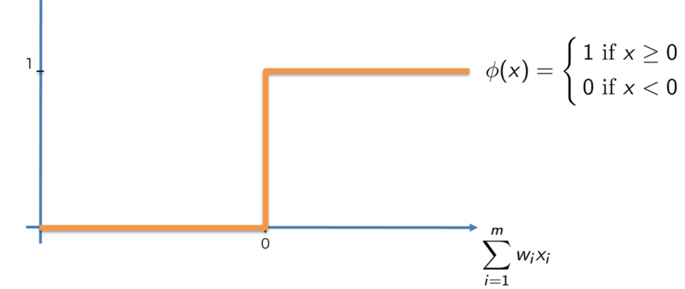
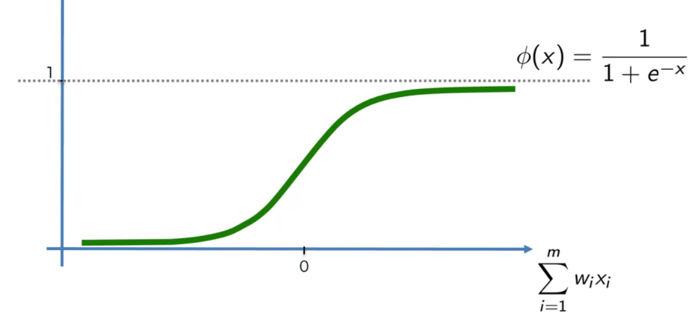
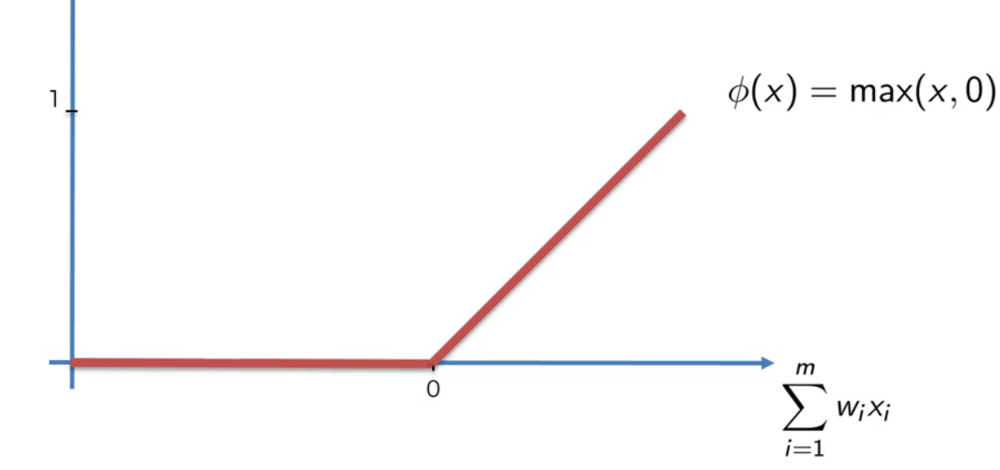
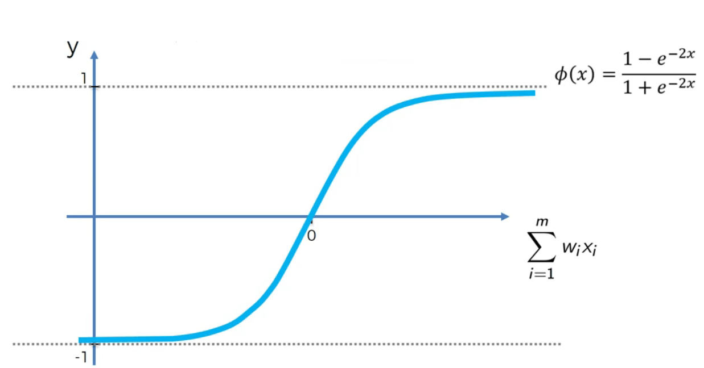
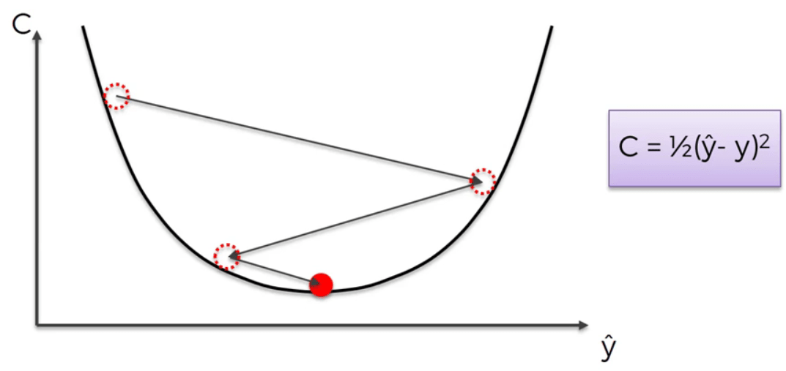
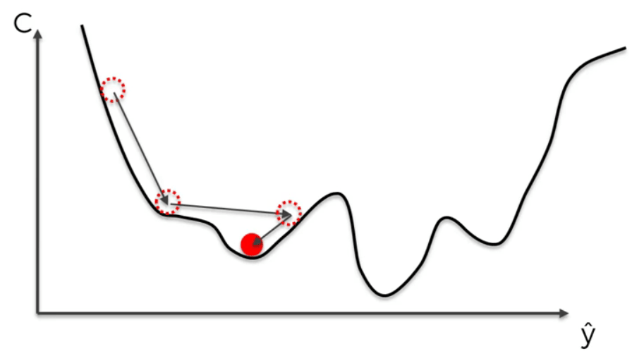
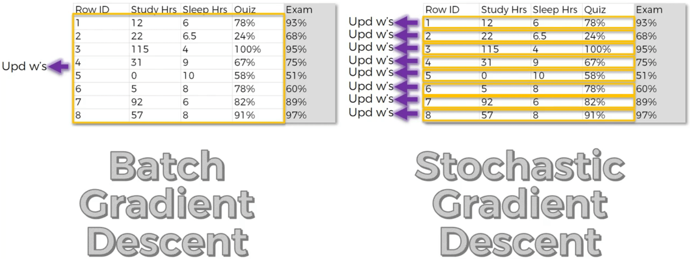

# Artificial Neural Networks

## Intuition

### The Neuron

Neuron is the basic part of the neural networks. Neurons in our body only have value when they are together. A neuron itself is kind of useless. Neurons have 3 parts. The neuron itself, the dendrites and the axons. Dendrites are the receivers of signals and axons are the senders of signals. Note that the dendrites and axons are not really connected. There is a little space between them which is called synapse.

Now let's look at the neurons in artificial neural networks. Each neuron has one or several input signals and has one or several output signals. The first set of input signals are called the input neurons that are our independent variables. The last set of neurons are called the output neurons which are our dependent variables. Note that, we have to standardize the independent variables before giving them to the ANN. This is done to make the calculations of the ANN better and easier. The output neuron can return a continuous, binary or categorical value. Moreover, the ANN runs for a single row at each time.

Then, there are weights. Each synapse has an individual weight. These weights are the main concern of the ANN since it tries to adjust these weights.

The steps of the calculations of a neuron are:

1. The weighted sum of the input values of the neuron. (weights are the weights of the synapses)
2. Using the activation function on the sum
3. passing the result to the output neuron

### The Activation Function

Types of activation function:

* Threshold function
  
  

* Sigmoid

  

* Rectifier

  

* Hyperbolic tangent (tanh)

  

### How Do Neural Networks Learn?

The ANN learning procedure has multiple steps:

1. Feeding the data in the ANN
2. Getting the output which is the predicted value
3. Comparing it with the actual value
4. Calculating the cost function (the most used is 1/2(y\^-y)\^2)
5. Updating the weights according to the cost value
6. Repeating the steps until we get cost value = 0 (which is unlikely, usually less than a certain value)

What about multiple rows of data? In this case, we feed each row of data to the ANN and get the predicted value for that row. Then, when we have all the predicted values, we compare each of them with its actual value. The cost function here is the sum of all of their 1/2(y\^-y)\^2. Then, we update the weights with this cost value.

### Gradient Descent

How can we update weights? An idea you may have is to test multiple weights and find the best one. This is not practical. We will hit the **Curse of Dimensionality**. What is the curse of dimesionality? It is when we have for example 25 wights to adjust. Imagine we choose 1000 values to test and find the optimal value for each weight. It means that we have 1000\^25 different set of weights to test. This is not possible to do even with the fastest computer which takes about 10\^50 years to complete the calculations.

So, what do we do? This is where **Gradient Descent** comes into play. This method works like this:

1. Choose a value and calculate the cost function.
2. Find the slope of the cost function at this poin.
3. If the slope is negative choose the next value greater than current value. If the slope is positive choose the next value less smaller than current value
4. Repeat steps 2 and 3



### Stochastic Gradient Descent

The Gradient Descent requires the cost function to be **convex**. What if the cost function is not convex? In this situation we could find the local minimum of the function not the actual minimum:



The answer here is **Stochastic Gradient Descent**. In this method unlike the gradient descent that updated the weights after a batch of rows, we will update the weights after observing each row of data.



Unlike what it seems the SGD is faster than GD. The only advantage that GD has over SGD is that it is deterministic which means every time you run it, it will give you the same updated weights, but the SGD has a random factor and will give different results each time.

### Backpropagation

The procedure of updating the weights after getting the predicted value is called **Backpropagation**. The key thing to remember here is that backpropagation updates all the weights simultaniously. The math and algorithm behind it has a structure to allow this important ability.

### Steps of Training the ANN with SGD

1. Randomly initialize the weights to small numbers close to 0 (but not 0).
2. Input the first observation of your dataset in the input layer, each feature in one input node.
3. Forward-Propagation: from left to right, the neurons are activated in a way that the impact of each neuron's activation is limited by the weights. Propagate the activations until getting the predicted result of y.
4. Compare the predicted result to the actual result. Measure the generated error.
5. Back-Propagation: from right to left, the error is back-propagated. Update the weights according to how much they are responsible for the error. The learning rate decides by how much we update the weights.
6. Repeat steps 1 to 5 and update the weights after each observation (Reinforcement Learning). Or: repeat steps 1 to 5 but update the weights only after a batch of observations (Batch Learning).
7. When the whole training set passed through the ANN, that makes an epoch. Redo more epochs.

## Practical

#### Importing the libraries

```python
import numpy as np
import pandas as pd
import tensorflow as tf
```

### Building the ANN

```python
ann = tf.keras.models.Sequential()
```

#### Adding the input layer and the first hidden layer

```python
ann.add(tf.keras.layers.Dense(units=6, activation="relu"))
```

#### Adding the second hidden layer

```python
ann.add(tf.keras.layers.Dense(units=6, activation="relu"))
```

#### Adding the output layer

```python
ann.add(tf.keras.layers.Dense(units=1, activation="sigmoid"))
```

### Training the ANN

#### Compiling the ANN

```python
ann.compile(optimizer="adam", loss="binary_crossentropy", metrics=['accuracy'])
```

#### Training the ANN on the Training set

```python
ann.fit(X_train, y_train, batch_size=32, epochs=100)
```

### Making the predictions and evaluating the model

#### Predicting the result of a single observation

```python
ann.predict(sc.transform([[1, 0, 0, 600, 1, 40, 3, 60000, 2, 1, 1, 50000]]))
```