# Convolutional Neural Networks

## Intuition

### What are Convolutional Neural Networks?

Simply put, they take images as input and give labels (image classes) as output. A trained CNN can even determine emotions in an image. Note that the output is a probability.

The CNN does not work directly with images. It works with 0s and 1s. There are 2 types of images:

* Black / White images: They can be converted to 2D arrays which in each position (pixel) a value between 0 and 255 (shows the intensity of color) can be.
* Colored images: The can be converted to 3D arrays which the third dimension is for RGB.

### Step 1 - Convolution Operation

Imagine we have an image as our input. We convert it to a matrix of numbers. This matrix is called the **input image**. Then, there is another matrix called **feature detector** (also called filter or kernel). The job of the feature detector is to find some patterns or features in the input image. The process of finding these features is that the feature matrix will be put on the input image from the top left; and for each position of the feature matrix, the value of that position in the feature matrix and the value of the same position of the input image will be multiplied and the sum of all these values will be put in a new matrix. Then, we move the feature detector number of columns to the right (the number of movement is called **stride**). When covered all the columns, move to the next row until all the rows are covered.

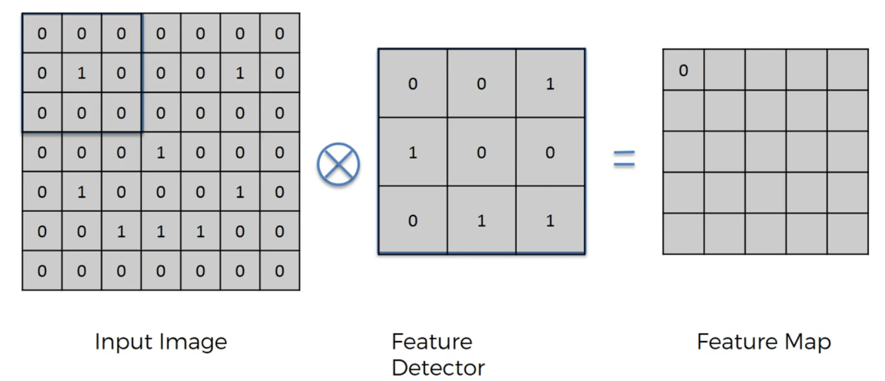

This new matrix is called the **feature map** (also called convolved feature). Note that, the size of the feature map is less than that of input image.

This process is done with different feature detectors to produce many different feature maps. All these feature maps together is called the convolutional layer.

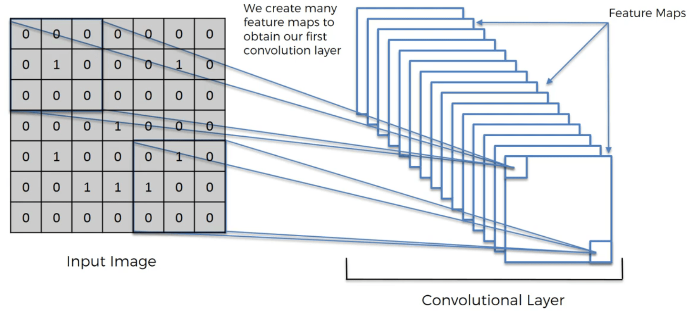

To better understand what feature detectors are, let's look at a feature detector and the feature it is looking for:

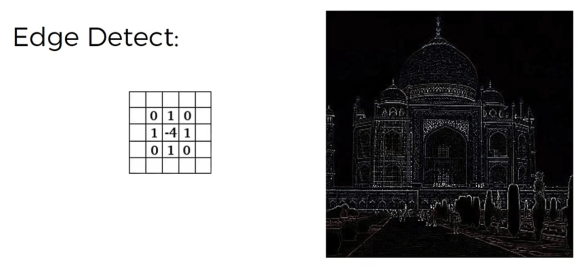

### Step 1 (b) - ReLU Layer

Now that we have our convolutional layer we need to take care of the linearity. What is linearity? If you look at the images around you, the colors or border blend with each other and do not jump from one color to another. This is an example of non linearity. Our convolutional layer is linear, as it jumps from one value to the other in adjacent pixels.

To solve this problem we use the rectifier function on our convolutional layer. Let's look at an example:

This is the original image:


This is what the convolutional layer gives us:

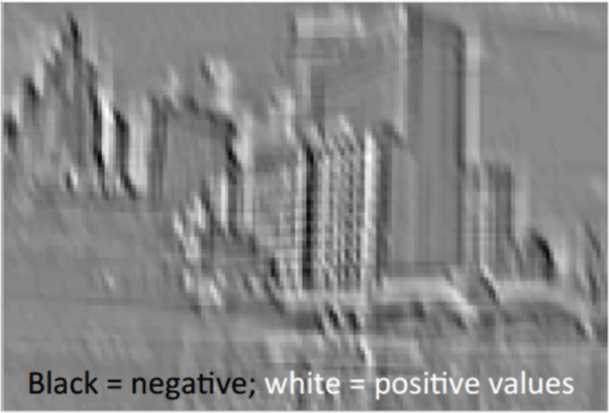

As can be seen, there are linearities in the transitions of black and white especially in the shadows.

This is after the rectifier function was uses on the convolutional layer:

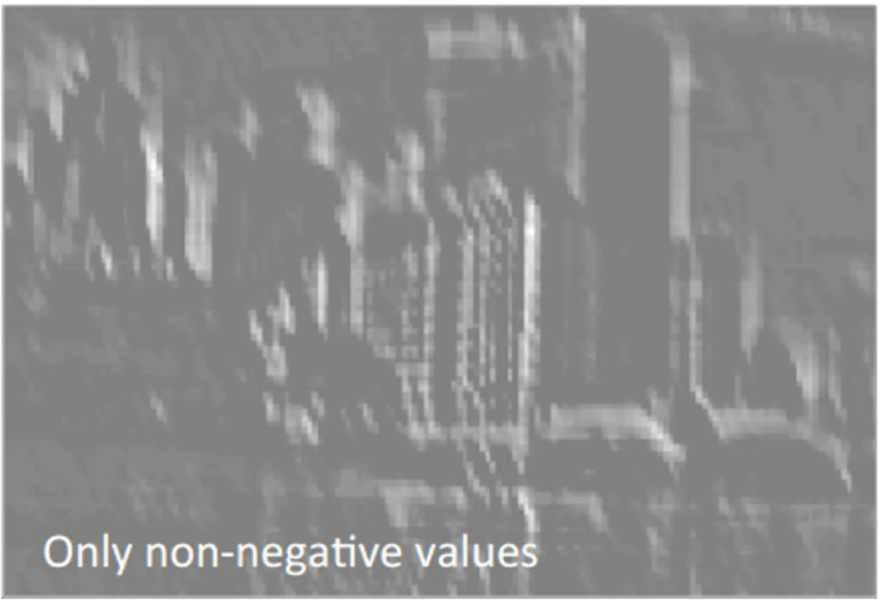

As can be seen, the transitions are now softer.

### Step 2 - Pooling

We have to make some margins of error and prevent the model from overfitting. We do this by pooling.

Pooling takes place after we have our final convolutional layer. This time we will take smaples of each feature map and make a smaller matrix called the **pooled feature map** and all of these matrixes together is called **pooling layer**. Let's see an example:

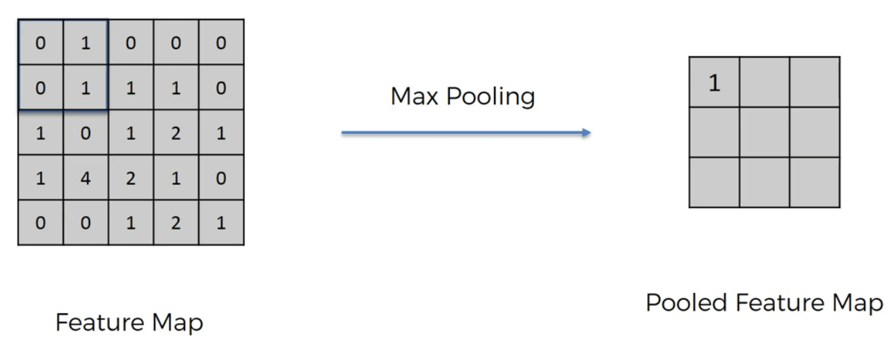

Note that when it is sampling, it takes the maximum of the part it is selecting. There are other versions that take the mean or sum.

### Step 3 - Flattening

After we have our pooled layer, we have to flatten it to be ready to be inputed to the neural network.

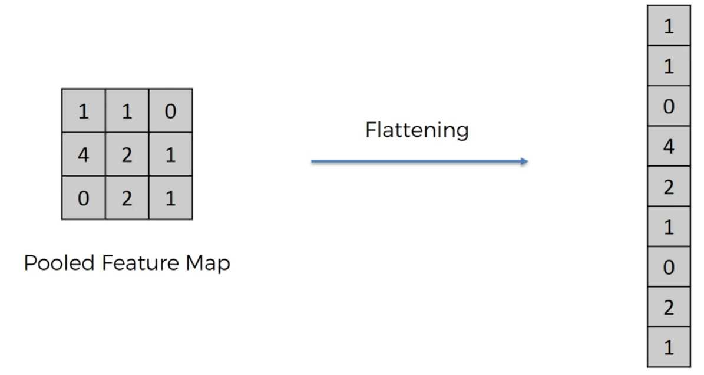

### Step 4 - Full Connection

Here we have to connect the flattened pooled layer to the neural network. The procedure is the same but in back propagation we have to also adjust the feature detectors.

### Summary

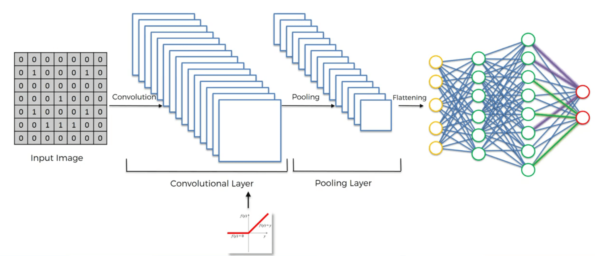

### Softmax & Cross-Entropy

In neural networks that have multiple neurons in the output layer, we want the sum of the probabilities to be 1. So, we use the **softmax** function on the output values which has the formula like this:

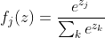

A better cost function to use in the CNN is the **cross-entropy** function which looks like this:

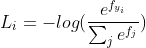

Another form of this formula is this:

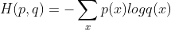

Note that, in CNNs cost function is called the **loss function**.

Also, pay attension that the cross-entropy function is used for classification problems not regression.

## Practical

#### Importing the libraries

```python
import numpy as np
import tensorflow as tf
from keras.preprocessing.image import ImageDataGenerator
```

### Data Preprocessing

#### Preprocessing the Training set

```python
train_datagen = ImageDataGenerator(rescale=1./255, shear_range=0.2, 
                                   zoom_range=0.2, horizontal_flip=True)
train_set = train_datagen.flow_from_directory('dataset/training_set',
                                                    target_size=(64, 64), 
                                                    batch_size=32,
                                                    class_mode="binary")
```

#### Preprocessing the Test set

```python
test_datagen = ImageDataGenerator(rescale=1./255)
test_set = test_datagen.flow_from_directory('dataset/test_set',
                                                    target_size=(64, 64), 
                                                    batch_size=32,
                                                    class_mode="binary")
```

### Building the CNN

#### Initialising the CNN

```python
cnn = tf.keras.models.Sequential()
```

#### Step 1 - Convolution

```python
cnn.add(tf.keras.layers.Conv2D(filters=32, kernel_size=3, activation="relu", input_shape=[64, 64, 3]))
```

#### Step 2 - Pooling

```python
cnn.add(tf.keras.layers.MaxPool2D(pool_size=(2, 2), strides=2))
```

#### Adding a second convolutional layer

```python
cnn.add(tf.keras.layers.Conv2D(filters=32, kernel_size=3, activation="relu"))
cnn.add(tf.keras.layers.MaxPool2D(pool_size=(2, 2), strides=2))
```

#### Step 3 - Flattening

```python
cnn.add(tf.keras.layers.Flatten())
```

#### Step 4 - Full Connection

```python
cnn.add(tf.keras.layers.Dense(units=128, activation="relu"))
```

#### Step 5 - Output Layer

```python
cnn.add(tf.keras.layers.Dense(units=1, activation="sigmoid"))
```

### Training the CNN

#### Compiling the CNN

```python
cnn.compile(optimizer="adam", loss="binary_crossentropy", metrics=["accuracy"])
```

#### Training the CNN on the Training set and evaluating it on the Test set

```python
cnn.fit(training_set, validation_data=test_set, epochs=25)
```

### Making a single prediction

```python
from keras.preprocessing import image
test_image = image.load_img('dataset/single_prediction/cat_or_dog_1.jpg', target_size=(64, 64))
test_image = image.img_to_array(test_image)
test_image = np.expand_dims(test_image, axis=0)
result = cnn.predict(test_image)
training_set.class_indices
if result[0][0] == 1:
    prediction = "dog"
else:
    prediction = "cat"
```