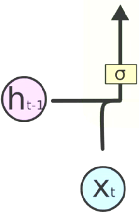

# Recurrent Neural Networks

## Intuition

### The Idea Behind RNNs

Sometimes we need to have a short-term memory in our neural network. RNNs are the ones with this capability.

The structure of RNNs is like this:

This is a normal ANN:


Then we squash it like this:


To make it more simple we will show RNNs like this:


Note that, the different neurons are still there. It is like we are looking from a bottom view.

To provide that short term memory that we want, RNNs have this:


This means that over time the hidden layers have access to previous learnings of the same neural network:


In reality, it looks like this with all the layers:


There are 3 different types of RNN and are used for different purposes:


### The Vanishing Gradient Problem

As we saw in the previous part, backpropagation and updating the weights in RNNs are not as simple as ANNs and CNNs. In RNNs each output layer has its own cost function and performs a backpropagation. For better illustration, imagine we want to backpropagate the network with the cost function of the ouput layer t. It will look something like this:


The problem is that going back through time and multiplying the weights is going to make the result so small that it **vanishes**. Note that the initial weights are small. As a result, multiplying them so many times will make it so small that it can not train the previous layers. When these layers are not trained, the later layers can not predict correct values.

There are some solutions for vanishing gradient:

* Weight initialization
* Echo state networks
* Long short-term memory networks (LSTM)

### Long Short-Term Memory (LSTM)

How can we solve the vanishing problem. It may look too simple but we only need to set the **W_rec** in the previous picture to 1. In this way, we will not have the problem of vanishing gradient or exploding gradient.

This is what a hidden layer at time t looks like from the inside:


* X_t is the input layer comming in this layer
* h_t-1 is the output layer of the layers of time t-1
* C_t-1 is the memory comming from the layers of time t-1
* h_t is the output layer of current time
* C_t is the memory updated in the current time

Note that each node is representing a layer.

Let's look at it step by step:



This parts evaluates a vector from the input and previous output to decide whether to consider the previous memory or not.


This part evaluates 2 values. One of them decides whether the other should be added to the memory information or not.


This part is where the previous parts sent their evaluated values. The left side X is called the **forget valve**. This is where the decision is made whether the previous memory should be considered. The right side X is called the **memory valve**. This is the place that it is decided whether consider the evaluated value of current input and previous output vectors to effect the memory. The + is there to cumulate the two inputs in the memory.


This part is where the output is evaluated. The X here is called the **output valve**. The output is evaluated corresponding to the current input and the previous output vectors. Note that the output is also derived from the current memory.

## Practical

### Part 1 - Data Preprocessing

#### Feature Scaling

```python
from sklearn.preprocessing import MinMaxScaler
sc = MinMaxScaler()
training_set_scaled = sc.fit_transform(training_set)
```

#### Creating a data structure with 60 timesteps and 1 output

```python
X_train = []
y_train = []
for i in range(60, len(training_set_scaled)):
    X_train.append(training_set_scaled[i-60:i, 0])
    y_train.append(training_set_scaled[i, 0])
X_train, y_train = np.array(X_train), np.array(y_train)
```

#### Reshaping

```python
X_train = np.reshape(X_train, (X_train.shape[0], X_train.shape[1], 1))
```

### Part 2 - Building and Training the RNN

#### Importing the Keras libraries and packages

```python
from keras.models import Sequential
from keras.layers import Dense, LSTM, Dropout
```

#### Initialising the RNN

```python
regressor = Sequential()
```

#### Adding the LSTM layers and some Dropout regularisation

```python
regressor.add(LSTM(units = 50, return_sequences = True, input_shape = (X_train.shape[1], 1)))
regressor.add(Dropout(0.2))

regressor.add(LSTM(units = 50, return_sequences = True))
regressor.add(Dropout(0.2))

regressor.add(LSTM(units = 50, return_sequences = True))
regressor.add(Dropout(0.2))

regressor.add(LSTM(units = 50))
regressor.add(Dropout(0.2))
```

#### Adding the output layer

```python
regressor.add(Dense(units = 1))
```

#### Compiling the RNN

```python
regressor.compile(optimizer = 'adam', loss = 'mean_squared_error')
```

#### Fitting the RNN to the Training set

```python
regressor.fit(X_train, y_train, epochs = 100, batch_size = 32)
```

### Part 3 - Making the predictions and visualising the results

#### Getting the real stock price of 2017

```python
dataset_test = pd.read_csv('Google_Stock_Price_Test.csv')
real_stock_price = dataset_test.iloc[:, 1:2].values
```

#### Getting the predicted stock price of 2017

```python
dataset_total = pd.concat((dataset_train["Open"], dataset_test["Open"]), axis=0)
inputs = dataset_total[len(dataset_total) - len(dataset_test) - 60:].values
inputs = inputs.reshape(-1, 1)
inputs = sc.transform(inputs)
X_test = []
for i in range(60, 80):
    X_test.append(inputs[i-60:i, 0])
X_test = np.array(X_test)
X_test = np.reshape(X_test, (X_test.shape[0], X_test.shape[1], 1))
predicted_stock_price = regressor.predict(X_test)
predicted_stock_price = sc.inverse_transform(predicted_stock_price)
```

#### Visualising the results

```python
plt.plot(real_stock_price, color="red", label="Real Google Stock Price")
plt.plot(predicted_stock_price, color="blue", label="Predicted Google Stock Price")
plt.title("Google Stock Price Prediction")
plt.xlabel("Time")
plt.ylabel("Google Stock Price")
plt.legend()
plt.show()
```

