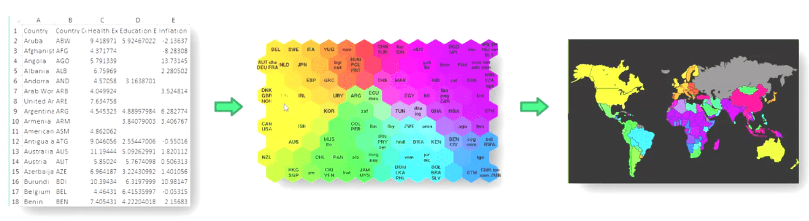
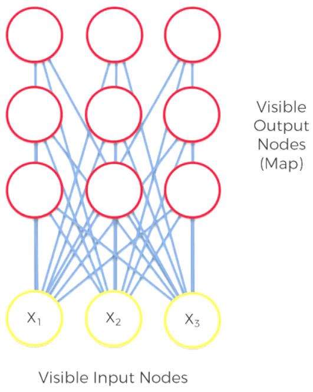
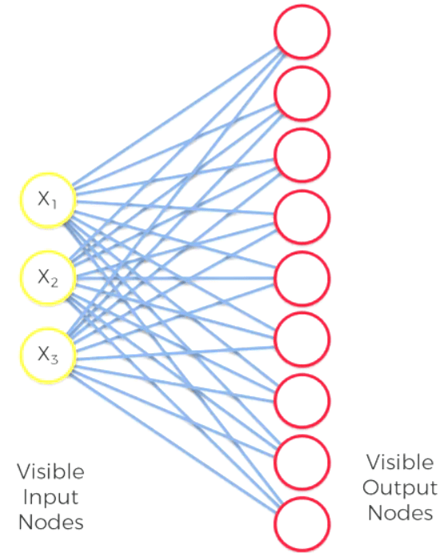
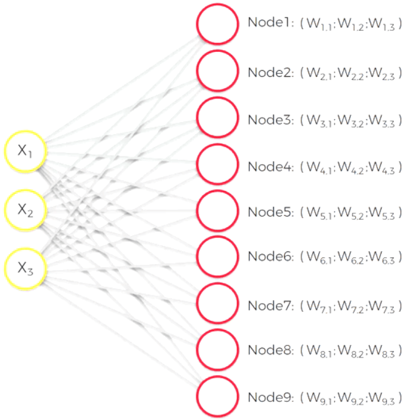
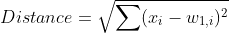
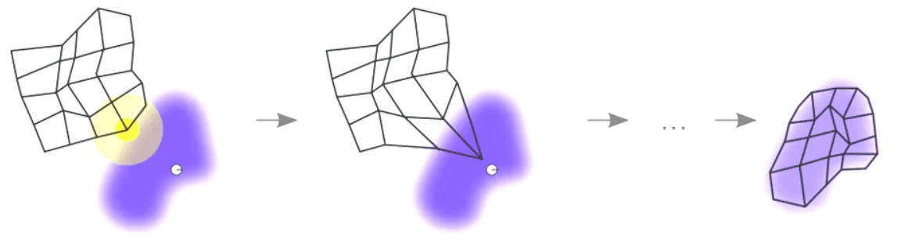

# Self Organizing Maps

## Intuition

### How Do Self-Organizing Maps Work?

SOMs are used for reducing dimensions. When we put we have a lot of columns and rows, we can not visualize different groups (clusters). SOMs help us to visualize them on a 2D space. Like this:

### How Do Self-Organizing Maps Learn?

The network of SOMs look like this:

The above picture clearly shows that the output is a 2D map, but to match the previous versions of neural networks, let's look at it from another angle:

Note that SOMs are completely different from neural netwoks, even if the pictures look alike.

We have weights here like the neural networks, but the difference is that the weights are characteristics of the node not the connection. So, it looks like this:

On each row of data we calculate the distance between the input layer and each output node with this formula:

Then, call the node with minimum distance the **best matching unit (BMU)**. In the next step, we update the weights of this node to make it even better. Also, the nodes around this BMU are going to update as well. The closer they to the BMU the more they are going to update. As an illustration look at this image:

On each epoch, the radius of each BMU becomes smaller. So, the updating becomes more focused.

Important to know:

* SOMs retain topology of the input set
* SOMs reveal correlations that are not easily identified
* SOMs classify data without supervision
* No target vector -> no backpropagation
* No lateral connections between output nodes

## Practical