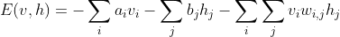
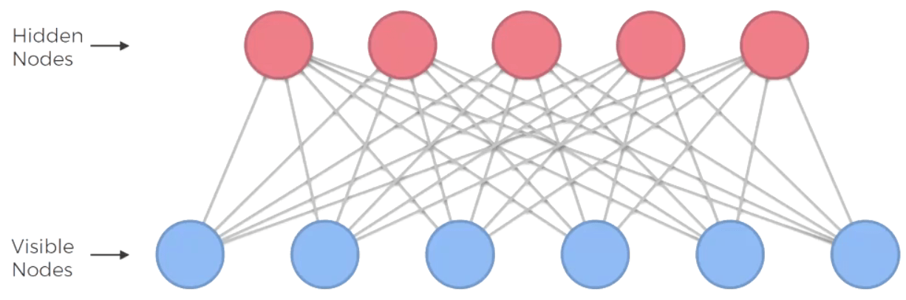

# Boltzmann Machines

## Intuition

### The Boltzmann Machine

Boltzmann Machines are undirected models:


Here is a Boltzmann Machine:


Differences with normal networks:

* There is no output layer.
* Everything is connected to each other. There is no layer structure.
* There is no directions in the connections. Conncetions go both ways.

Boltzmann machines are fundementaly different to all other algorithms. They do not expect data. They generate data in all nodes. All nodes are the same for the boltzmann machine. It generates all parameters itself. It generates different states of the machine. This is the essence why it is not a deterministic machine but a stochastic. As an illustration, imagine a powre plant. We measure a lot of different parameters like how much electericity the power plant produces, or how much pressure is there in the pipes, but we do not measure the moisture of the soil in different points, or the speed of the wind. The boltzmann machine takes care of these parameters by generating its own data.

The boltzmann machine is specific to our situation. It is not a general model. We can use it to monitor our own system for example power plant.

### Energy-Based Models (EBM)

This is the boltzmann distribution:


The reason behind the name boltzmann machine is that these machines use the boltzmann distribution to generate different states.

The epsilon states the energy of the state. So, the bigger the energy, the less the probability. In boltzmann machines, energy is defined through weights and the machine always tries to be at the lowest energy state.

The formula is translated for the boltzmann machine like this:

The energy between the visible node and hidden node:



The probability of the state:


### Restricted Boltzmann Machine (RBM)

In theory the full boltzmann machine is a great model, but in practice it is very hard to implement because when we add nodes the number of connections grows exponentialy. Therefore, we use RBMs that look like this:



The difference is that the visible nodes can not connect to each other and the same for hidden nodes.

The way it works is when observing different rows of the dataset, the RBM identifies correlations between different inputs and classifies that as a feature in a hidden node. Something like this:


Note that the names of the features are there for better understanding. In reality the machine has no idea what those features are.

Then for the testing section, it will light up the features that correspond the movies the user has liked and with them construct the movies the user has not watched.

### Contractive Divergence (CD)

The training process is different to previous networks. The process of training looks like this:


As can be seen we input the visible nodes to the hidden nodes with random weights at the start. Then we reconstruct the visible nodes with the hidden layers. Note that the newly constructed visible nodes are not the same with their previous values. That is because the hidden nodes were constructed with all the visible nodes. So combining them together does not make the same value for a visible node. We continue this process of updating weights, constructing the hidden nodes and reconstructing the visible nodes until the newly constructed visible nodes become the same as their previous values. This is the optimal point. This is better understood with the energy curve:


Geoffrey Hinton discovered a shortcut which is even if we take the first two steps of the picture, we will get a sufficient point. To better understand, let's take a look at the energy curve:


Unlike the gradient descent, we have controll over the curve and we can adjust the curve to make a point the minimum point of the curve:


### Deep Belief Networks (DBN)

DBNs are multiple RBMs stacked on top of each other.


We make sure that the direction between layers are downwards and only the connections between top two layers do not have direction.

### Deep Boltzmann Machines (DBM)

The DBM is like the DBN except that there is no direction in DBMs.

## Practical

### Importing the libraries

```python
import numpy as np
import pandas as pd
import torch
import torch.nn as nn
import torch.nn.parallel
import torch.optim as optim
import torch.utils.data
from torch.autograd import Variable
```

### Preparing the training set and the test set

```python
training_set = pd.read_csv('ml-100k/u1.base', delimiter = '\t')
training_set = np.array(training_set, dtype = 'int')
test_set = pd.read_csv('ml-100k/u1.test', delimiter = '\t')
test_set = np.array(test_set, dtype = 'int')
```

### Getting the number of users and movies

```python
nb_users = int(max(max(training_set[:, 0], ), max(test_set[:, 0])))
nb_movies = int(max(max(training_set[:, 1], ), max(test_set[:, 1])))
```

### Converting the data into an array with users in lines and movies in columns

```python
def convert(data):
    new_data = []
    for id_users in range(1, nb_users + 1):
        id_movies = data[:, 1] [data[:, 0] == id_users]
        id_ratings = data[:, 2] [data[:, 0] == id_users]
        ratings = np.zeros(nb_movies)
        ratings[id_movies - 1] = id_ratings
        new_data.append(list(ratings))
    return new_data
training_set = convert(training_set)
test_set = convert(test_set)
```

### Converting the data into Torch tensors

```python
training_set = torch.FloatTensor(training_set)
test_set = torch.FloatTensor(test_set)
```

### Converting the ratings into binary ratings 1 (Liked) or 0 (Not Liked)

```python
training_set[training_set == 0] = -1
training_set[training_set == 1] = 0
training_set[training_set == 2] = 0
training_set[training_set >= 3] = 1
test_set[test_set == 0] = -1
test_set[test_set == 1] = 0
test_set[test_set == 2] = 0
test_set[test_set >= 3] = 1
```

### Creating the architecture of the Neural Network

```python
class RBM():
    def __init__(self, nv, nh):
        self.W = torch.randn(nh, nv)
        self.a = torch.randn(1, nh)
        self.b = torch.randn(1, nv)
    
    def sample_h(self, x):
        wx = torch.mm(x, self.W.t())
        activation = wx + self.a.expand_as(wx)
        p_h_given_v = torch.sigmoid(activation)
        return p_h_given_v, torch.bernoulli(p_h_given_v)
    
    def sample_v(self, y):
        wy = torch.mm(y, self.W)
        activation = wy + self.b.expand_as(wy)
        p_v_given_h = torch.sigmoid(activation)
        return p_v_given_h, torch.bernoulli(p_v_given_h)
    
    def train(self, v0, vk, ph0, phk):
        self.W += (torch.mm(v0.t(), ph0) - torch.mm(vk.t(), phk)).t()
        self.b += torch.sum((v0 - vk), 0)
        self.a += torch.sum((ph0 - phk), 0)
    
nv = len(training_set[0])
nh = 100
batch_size = 100
rbm = RBM(nv, nh)
```

### Training the RBM

```python
nb_epoch = 10
for epoch in range(1, nb_epoch + 1):
    train_loss = 0
    s = 0.
    for id_user in range(0, nb_users - batch_size, batch_size):
        vk = training_set[id_user : id_user + batch_size]
        v0 = training_set[id_user : id_user + batch_size]
        ph0,_ = rbm.sample_h(v0)
        for k in range(10):
          _,hk = rbm.sample_h(vk)
          _,vk = rbm.sample_v(hk)
          vk[v0<0] = v0[v0<0]
        phk,_ = rbm.sample_h(vk)
        rbm.train(v0, vk, ph0, phk)
        train_loss += torch.mean(torch.abs(v0[v0 >= 0] - vk[v0 >= 0]))
        s += 1.
    print('epoch: '+str(epoch)+' loss: '+str(train_loss/s))
```

### Testing the RBM

```python
test_loss = 0
s = 0.
for id_user in range(nb_users):
    v = training_set[id_user:id_user+1]
    vt = test_set[id_user:id_user+1]
    if len(vt[vt>=0]) > 0:
        _,h = rbm.sample_h(v)
        _,v = rbm.sample_v(h)
        test_loss += torch.mean(torch.abs(vt[vt>=0] - v[vt>=0]))
        s += 1.
print('test loss: '+str(test_loss/s))
```