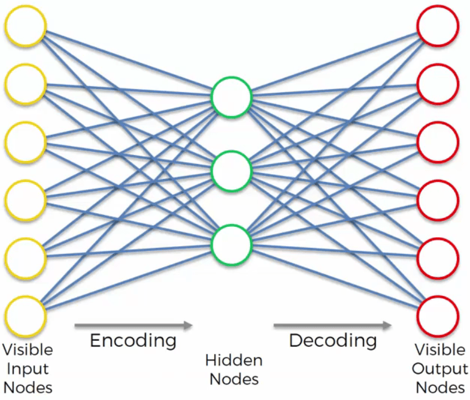
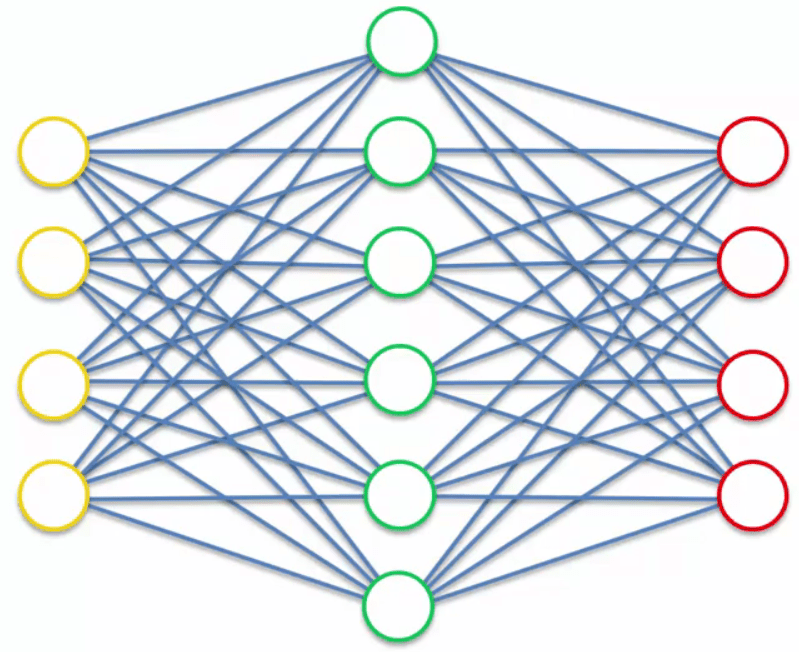
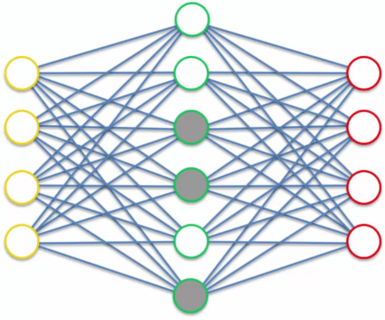
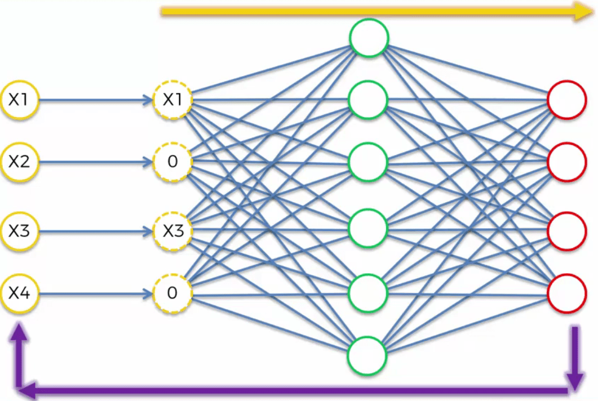
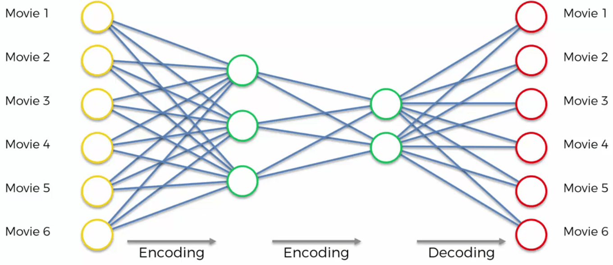
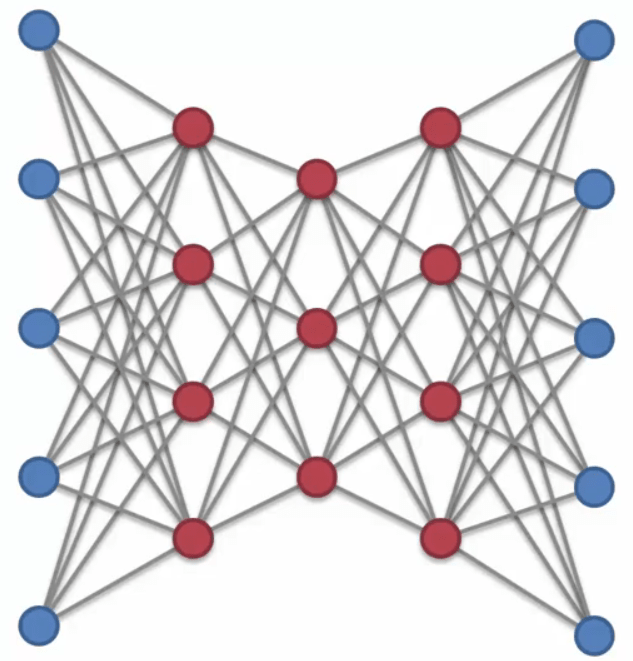

# Auto Encoders

## Intuition

### What Are Auto Encoders?

This is what an auto encoder looks like:



It takes some sort of input, passes them to the hidden layer, then passes them to the output layer. It will try to get the same values as the input layer in the output layer. So, it is a self supervising model not a normal supervising model. That is why it is in the unsupervised models.

### Training Auto Encoders

Imagine a dataset containing users' ratings on different movies. The steps of training are:

1. We start with an array where the lines (the observations) correspond to the users and columns (the features) correspond to the movies. Each cell (u, i) contains the rating (from 1 to 5, 0 if no rating) of the movie i by the user u.
2. The first user goes into the network. The input vector x = (r1, r2, ..., rm) contains all its ratings for all the movies.
3. The input vector x is encoded into a vector z of lower dimensions by a mapping function f (e.g: sigmoid functions, usually the tanh):  
z = f(Wx + b) where W is the vector of input weights and b is the bias
4. z is then decoded into the output vector y of same dimensions as x, aiming to replicate the input vector x.
5. The reconstruction error d(x, y) = ||x - y|| is computed. The goal is to minimize it.
6. Back-Propagation: from right to left, the error is back-propagated. The weights are updated according to how much they are responsible for the error. The learning rate decides by how much we update the weights.
7. Repeat steps 1 to 6 and update the weights after each observation (Reinforcement Learning). Or: Repeat steps 1 to 6 but update the weights only after a batch of observations (Batch Learning).
8. When the whole training set passed through the ANN, that makes an epoch. Redo more epochs.

### Overcomplete Hidden Layers

Sometimes we want to extract more features from our auto encoder. To do that, we need more neurons in the hidden layer. However, there is a problem. The model can cheat while training and easily copy the input in the output. As a result, we cannot extract any valuable information from the model. This problem is called the overcomplete hidden layers.



### Sparse Auto Encoders

One solution to the previous problem is to use sparse auto encoders. This type of auto encoder is very popular in the industry and sometimes people mean this type when the say auto encoders. Simply put, to avoid the previous problem, we use a regularization technique. It introduces a constraint on the loss function that does not allow the model to use all the hidden nodes in each observation. Note that each time the disabled nodes are different.



### Denoising Auto Encoders

Another solution to the problem is to pass another form of the input to the ANN. To put it differently, we save the actual input, but we pass a transformed version of it to the ANN. The point is that when the ANN wants to back-propagate, it compares the output with the actual input. In this way, the model cannot cheat the training phase.



### Contractive Auto Encoders

Another solution to the problem is to specify a penalty to the back-propagation loss function that prevents the problem. This is a very complex subject. So, it is here just to know this solution exists.

### Stacked Auto Encoders

Stacked auto encoders have multiple hidden layers. This is done to better encode the input and try to have a better result.



### Deep Auto Encoders

Deep auto encoders are actually RBMs. The difference is that the connections are directed.



## Practical

### Creating the architecture of the Neural Network

```python
class SAE(nn.Module):
    def __init__(self, ):
        super(SAE, self).__init__()
        self.fc1 = nn.Linear(nb_movies, 20)
        self.fc2 = nn.Linear(20, 10)
        self.fc3 = nn.Linear(10, 20)
        self.fc4 = nn.Linear(20, nb_movies)
        self.activation = nn.Sigmoid()
    
    def forward(self, x):
        x = self.activation(self.fc1(x))
        x = self.activation(self.fc2(x))
        x = self.activation(self.fc3(x))
        x = self.fc4(x)
        return x
    
sae = SAE()
criterion = nn.MSELoss()
optimizer = optim.RMSprop(sae.parameters(), lr=0.01, weight_decay=0.5)
```

### Training the SAE

```python
nb_epoch = 200
for epoch in range(nb_epoch):
    train_loss = 0
    s = 0.0
    for id_user in range(nb_users):
        input = Variable(training_set[id_user]).unsqueeze(0)
        target = input.clone()
        if torch.sum(target.data > 0) > 0:
            output = sae.forward(input)
            target.require_grad = False
            output[target == 0] = 0
            loss = criterion(output, target)
            mean_corrector = nb_movies / float(torch.sum(target.data > 0) + 1e-10)
            loss.backward()
            train_loss += np.sqrt(loss.data * mean_corrector)
            s += 1.0
            optimizer.step()
    print("epoch: " + str(epoch + 1) + ", loss: " + str(train_loss / s))
```

### Testing the SAE

```python
test_loss = 0
s = 0.0
for id_user in range(nb_users):
    input = Variable(training_set[id_user]).unsqueeze(0)
    target = Variable(test_set[id_user]).unsqueeze(0)
    if torch.sum(target.data > 0) > 0:
        output = sae.forward(input)
        target.require_grad = False
        output[target == 0] = 0
        loss = criterion(output, target)
        mean_corrector = nb_movies / float(torch.sum(target.data > 0) + 1e-10)
        test_loss += np.sqrt(loss.data * mean_corrector)
        s += 1.0
print("test loss: " + str(test_loss / s))
```