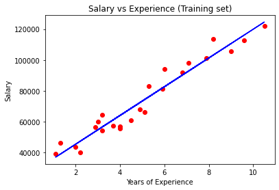
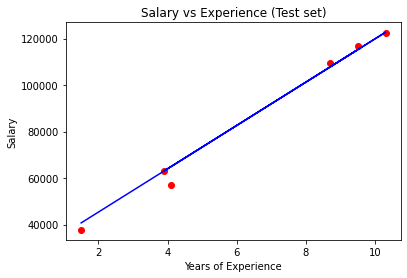

# Simple Linear Regression

## Intuition

### Formula

Simple regression is a simple linear functions as follows:


The variables and coefficients are:
* y: Dependent Variable (DV). The variable we want to explain and predict.
* x1: Independent Variable (IV). The variable that has effect on the DV and changes it. It might not directly change it but there is some kind of association between the two.
* b1: Coefficient. Determines how a unit change in x1 effects a unit change in y.
* b0: Constant.

Let's look at an example:


We want to understand how salary depends on people's experience. The red dots are some observations that we have. Simple regression draws the black line that tries to fit the data in the best way. The Constant mean the point where the line crosses the y axes.


It means when experience is 0, salary is 30,000 dolors. b1 is the slope of the line. The steeper the line, greater b1 is.


### Best Fitting Line


The model line shows us where these red crosses should be according to the model. "y" is what the observation shows us and "y^" is what the model predicts where "y" should be. The green line between them is the distance of "y" and "y^". Simple linear regression draws a lot of these lines for all the observations and calculate the distance with ( y - y^ )^2^ and then calculate the sum of this formula for all of the observations and finally find the minimum of these sums for different model lines. This method is called **Ordinary Least Squares**.

## Practical

The library we use for simple linear regression is from scikit-learn:

```python
from sklearn.linear_model import LinearRegression
```

To create the simple linear regression model and fit the model on the data, we do this:

```python
regressor = LinearRegression()
regressor.fit(X_train, y_train)
```

To predict with the trained model, we simply do this:

```python
regressor.predict(X_test)
```

### Visualising the Training set results



### Visualising the Test set results


