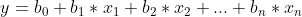

# Multiple Linear Regression

## Intuition

Same as simple linear regression but with many variables:



The x variables are the independent variables. So in this model a lot of variables effect y.

Linear regression has a set of assumptions:

1. Linearity
2. Homoscedasticity
3. Multivariate normality
4. Independence of errors
5. Lack of multicollinearity

Before making a linear regression model, we need to check if these assumptions are true.

### Dummy Variables

When a variable is categorical, we can not use them in the formula. For example imagine a variable is the state where a company is places. As can be seen, the state variable is of type string. To make it numerical, we have to create dummy variable. They way we do it is to look at the variable and see how many categories it has. Imagine it is n. Then, we replace the variable with n new variables that are only 0 or 1. If you remember data preprocessing, it is the same procedure we did for one hot encoding. Each new variable corresponds to a category of our previous variable. So, these variables will be 1 where the previous variable had the same category corresponding to this variable and will be 0 otherwise.

#### Dummy Variable Trap

**Be careful!** We should never include all the dummy variables in the formula. we should always exclude one of them. The reason is that we do not need it. We know that the sum of the dummy variables is 1. So, if we know all of their values except one, we can find it by subtractin these values from 1. Maybe it looks bias because we are not including on dummy variable and you may imagine that the model does not care about that last dummy variable. However, the reality is that the constant will play its part to make sure the last dummy variable will not get forgotten.

### P-Value

Imagine a coin toss situation in two different universes:

1. The coin is fair
2. The coin is not fair

We assume that we live in the first universe. We toss the coin. It is tails. How do we feel? Probably nothing. It was a 0.5 probability. Again we toss the coin. It is tails again. How do we feel now? Probably nothing again. It was a 0.25 probability. Again we toss the coin. It is tails again. How do we feel now? Probably somewhat suspicious. It was about 0.12 probability. Again we toss the coin. It is tails again. How do we feel now? Suspicious. It was about 0.06 probability. So it is really unlikely to see a coin land on tails 4 times in a row in a fair universe.
This example shows that the p-value is droping with each tail back to back. Because our first assumption is getting weaker each time.

### Building Models

How do we decide what features are good enough to train the model on them. There are 5 ways to build a model:

1. All-in
2. Backward Elimination
3. Forward Selection
4. Bidirectional Elimination
5. Score Comparison

Some call numbers 2, 3 and 4 the "Stepwise Regression".

#### All-in

Using all the variables.
Why to use this method:

* Prior knowledge: The variables are all important or not having a choice and should use all variables.
* Preparing for Backward Elimination

#### Backward Elimination

There are 5 steps to this method:

1. Select a significance level to stay in the model (e.g. SL=0.05)
2. Fit the full model with all possible predictors
3. Consider the predictor with the highest P-value. If P>SL, go to step 4, otherwise go to FIN
4. Remove the predictor
5. Fit model without this variable. Go back to step 3.

#### Forward Selection

There are 4 steps to this method:

1. Select a significance level to enter the model (e.g. SL=0.05)
2. Fit all simple regression models y~xn. Select the one with the lowest P-value
3. Keep this variable and fit all possible models with on extra predictor added to the one(s) you already have
4. Consider the predictor with the lowest P-value. If P<SL, go to step 3, otherwise go to FIN

at the end our model is the last model without the last variable added. That is because the last variable was insignificant.

#### Bidirectional Elimination

There are 5 steps to this method:

1. Select a significance level to enter and to stay in the model (e.g. SLENTER=0.05, SLSTAY=0.05)
2. Perform the next step of Forward Selection (new variables must have: P<SLENTER to enter)
3. Perform all steps of Backward Elimination (old variables must have P<SLSTAY to stay)
4. No new variables can enter and no old variables can exit

#### All Possible Models

There are 3 steps to this method:

1. Select a criterion of goodness to fit (e.g. Alaike criterion)
2. Construct all possible regression models: 2^N^-1 total combinations
3. Select the one with the best criterion

As can be seen this method is very resourse and time consuming

## Practical

The library we use for multiple linear regression is from scikit-learn:

```python
from sklearn.linear_model import LinearRegression
```

To create the multiple linear regression model and fit the model on the data, we do this:

```python
regressor = LinearRegression()
regressor.fit(X_train, y_train)
```

To predict with the trained model, we simply do this:

```python
regressor.predict(X_test)
```

The think to note is that we do not to worry about the dummy trap, because the scikit-learn takes care of it for us.
