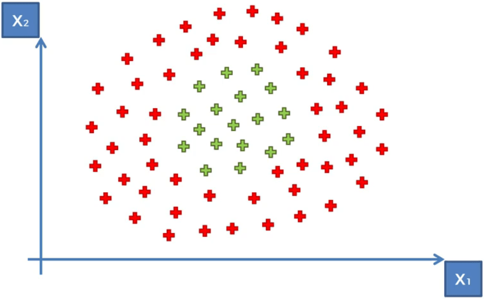
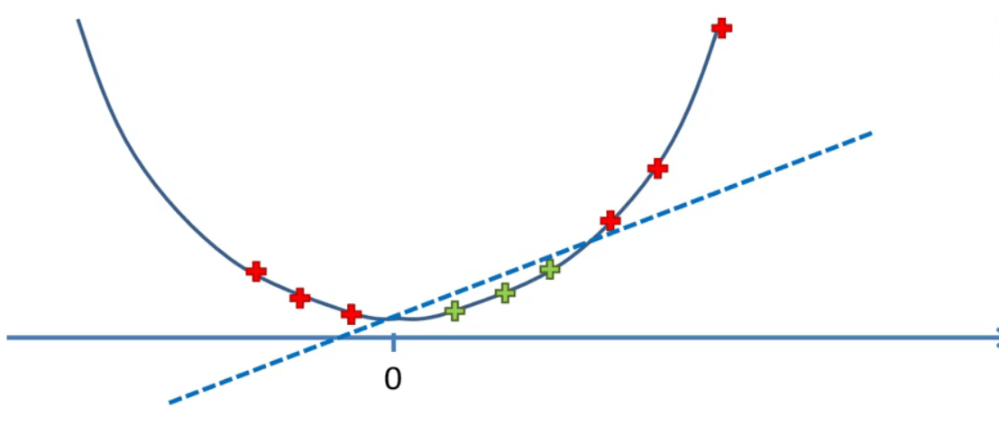
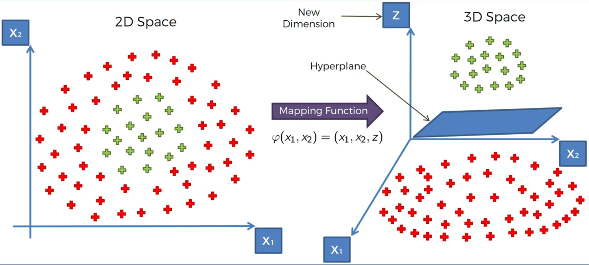
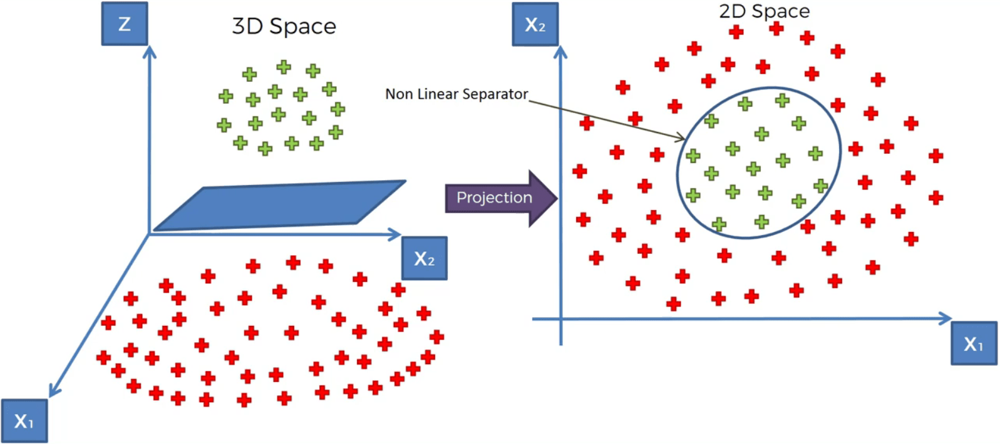
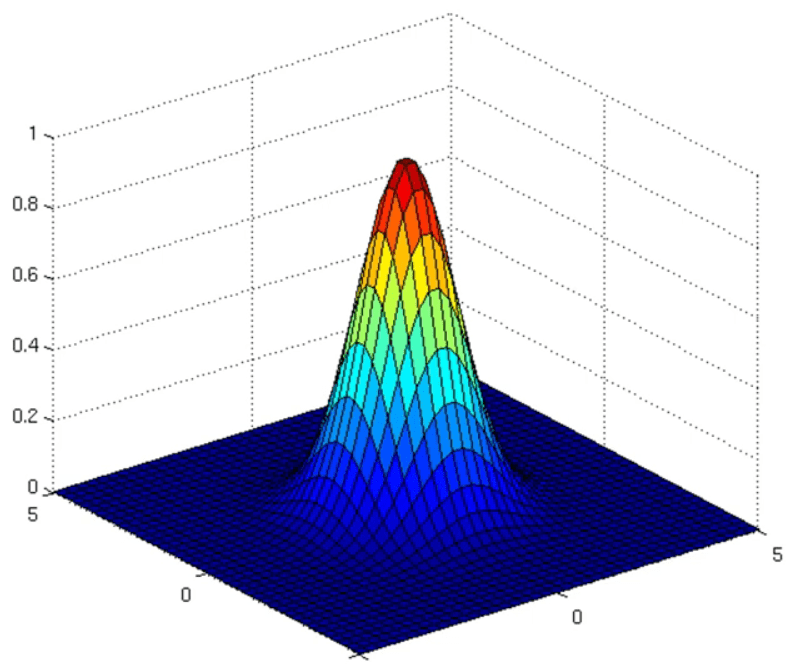
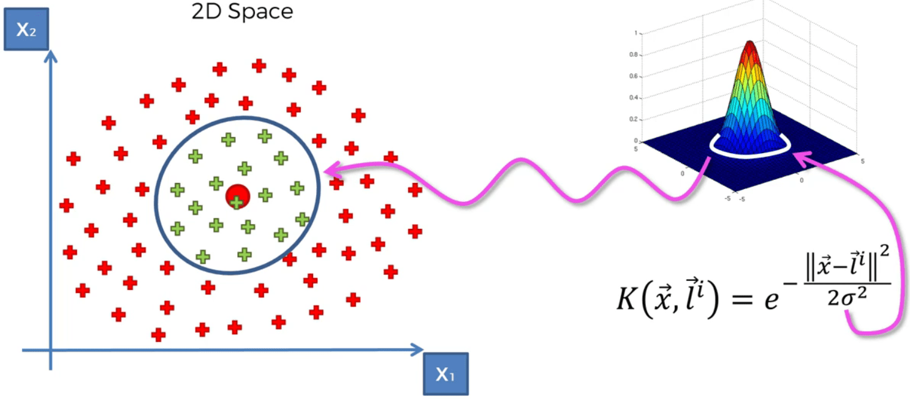
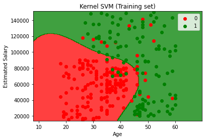
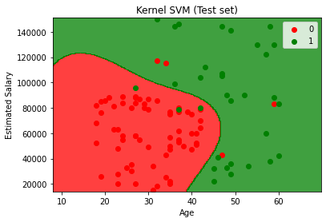

# Kernel SVM

## Intuition

SVM separates datasets that are linearly separable quite well, but what if they are not linearly separable? Consider the following dataset:



Whatever we do, we can not separate the two categories. There are some ways to handle these kinds of dataset.

### Mapping to a Higher Dimension

Let's look at a simplified example. We have some data points in 1D like this:


As can be seen this is a non linearly separable dataset. We are going to take these steps:

1. f = x - 5
2. f = (x - 5) ^ 2

Now, we have a linearly separable dataset:



Now that we know it works, let's look at a 2D example:





There is a problem with this solution. Mapping to a higher dimension can be highly compute-intensive

### Kernel Trick

#### The Gaussian RBF Kernel


This formula makes this shape:



The tip of the shape is in the middle of the shape which is equal to the landmark (l). "x" is the data point that we want to observe.

With this function we can separate the two classes in the following dataset:



There are different types of kernel functions:

* Sigmoid Kernel
* Polynomial Kernel

## Practical

### Training the Kernel SVM model on the Training set

```python
from sklearn.svm import SVC
classifier = SVC(random_state=0)
classifier.fit(X_train, y_train)
```

### Visualising the Training set results

```python
from matplotlib.colors import ListedColormap
X_set, y_set = sc.inverse_transform(X_train), y_train
X1, X2 = np.meshgrid(np.arange(start = X_set[:, 0].min() - 10, stop = X_set[:, 0].max() + 10, step = 0.25),
                     np.arange(start = X_set[:, 1].min() - 1000, stop = X_set[:, 1].max() + 1000, step = 0.25))
plt.contourf(X1, X2, classifier.predict(sc.transform(np.array([X1.ravel(), X2.ravel()]).T)).reshape(X1.shape),
             alpha = 0.75, cmap = ListedColormap(('red', 'green')))
plt.xlim(X1.min(), X1.max())
plt.ylim(X2.min(), X2.max())
for i, j in enumerate(np.unique(y_set)):
    plt.scatter(X_set[y_set == j, 0], X_set[y_set == j, 1], c = ListedColormap(('red', 'green'))(i), label = j)
plt.title('Kernel SVM (Training set)')
plt.xlabel('Age')
plt.ylabel('Estimated Salary')
plt.legend()
plt.show()
```



### Visualising the Test set results

```python
from matplotlib.colors import ListedColormap
X_set, y_set = sc.inverse_transform(X_test), y_test
X1, X2 = np.meshgrid(np.arange(start = X_set[:, 0].min() - 10, stop = X_set[:, 0].max() + 10, step = 0.25),
                     np.arange(start = X_set[:, 1].min() - 1000, stop = X_set[:, 1].max() + 1000, step = 0.25))
plt.contourf(X1, X2, classifier.predict(sc.transform(np.array([X1.ravel(), X2.ravel()]).T)).reshape(X1.shape),
             alpha = 0.75, cmap = ListedColormap(('red', 'green')))
plt.xlim(X1.min(), X1.max())
plt.ylim(X2.min(), X2.max())
for i, j in enumerate(np.unique(y_set)):
    plt.scatter(X_set[y_set == j, 0], X_set[y_set == j, 1], c = ListedColormap(('red', 'green'))(i), label = j)
plt.title('Kernel SVM (Test set)')
plt.xlabel('Age')
plt.ylabel('Estimated Salary')
plt.legend()
plt.show()
```

