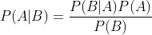
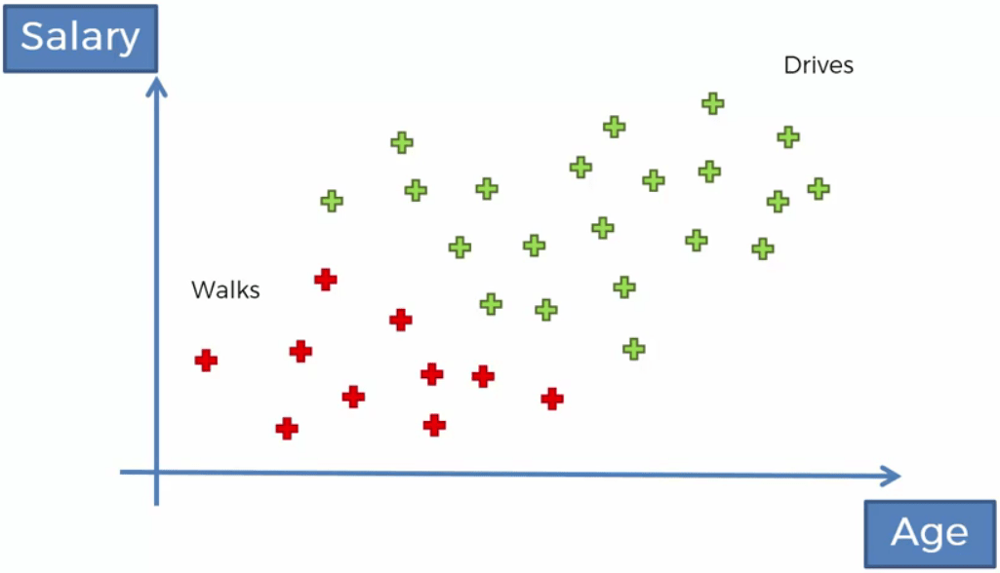
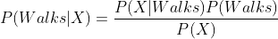
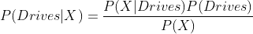
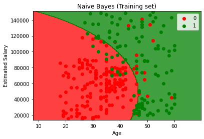
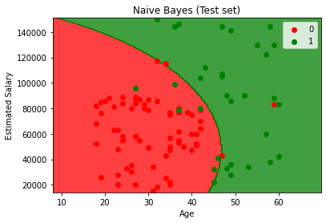

# Naive Bayes

## Intuition

### Bayes Theorem

The formula of the bayes theorem is:



This formula is used to calculate the inverse conditional probability. Imagin that we know the probability of B given A and we know the probability of A and B. We can calculate probability of A given B using the bayes theorem.

### Naive Bayes Classifier

Imagine we have the following dataset:



Now we add a new point to the dataset. How are we going to classify this new point?

#### Plan of Attack

We are going to use the bayes theorem and apply it twice. First we are going to use it to find out the probability of the new person walking. Like this:



Second we are going to use it to find out the probability of the new person driving the exact same way.



When we find the probabilities, we just compare the two and select the one with the higher probability.

P(Walks) (prior probability) can be calculated by the number of points that walk divided by the number of total points.

P(X) (marginal likelihood) is calculated in this way that we draw a circle around the new point with a custom radius. Then, in the circle there are some points. Now P(X) is the number of points in the circle divided by the total number of points.

P(X|Walks) (likelihood) can be calculated by the number of points that walk in the previous circle divided by the total number of points that walk.

The calculations are the same with P(Drives|X).

#### Why Naive

There is the independence assumption to use the bayes theorem, but usually our features are not independent. This is where the "Naive" comes from.

#### Droping P(X)

After finding the two probabilities in the plan of attack section, we have to compare them to find the higher one. Note that in comparison P(X) is the same in both formulas. So, we can ignore it and never use it.

## Practical

### Training the Naive Bayes model on the Training set

```python
from sklearn.naive_bayes import GaussianNB
classifier = GaussianNB()
classifier.fit(X_train, y_train)
```

### Visualising the Training set results

```python
from matplotlib.colors import ListedColormap
X_set, y_set = sc.inverse_transform(X_train), y_train
X1, X2 = np.meshgrid(np.arange(start = X_set[:, 0].min() - 10, stop = X_set[:, 0].max() + 10, step = 0.25),
                     np.arange(start = X_set[:, 1].min() - 1000, stop = X_set[:, 1].max() + 1000, step = 0.25))
plt.contourf(X1, X2, classifier.predict(sc.transform(np.array([X1.ravel(), X2.ravel()]).T)).reshape(X1.shape),
             alpha = 0.75, cmap = ListedColormap(('red', 'green')))
plt.xlim(X1.min(), X1.max())
plt.ylim(X2.min(), X2.max())
for i, j in enumerate(np.unique(y_set)):
    plt.scatter(X_set[y_set == j, 0], X_set[y_set == j, 1], c = ListedColormap(('red', 'green'))(i), label = j)
plt.title('Naive Bayes (Training set)')
plt.xlabel('Age')
plt.ylabel('Estimated Salary')
plt.legend()
plt.show()
```



### Visualising the Test set results

```python
from matplotlib.colors import ListedColormap
X_set, y_set = sc.inverse_transform(X_test), y_test
X1, X2 = np.meshgrid(np.arange(start = X_set[:, 0].min() - 10, stop = X_set[:, 0].max() + 10, step = 0.25),
                     np.arange(start = X_set[:, 1].min() - 1000, stop = X_set[:, 1].max() + 1000, step = 0.25))
plt.contourf(X1, X2, classifier.predict(sc.transform(np.array([X1.ravel(), X2.ravel()]).T)).reshape(X1.shape),
             alpha = 0.75, cmap = ListedColormap(('red', 'green')))
plt.xlim(X1.min(), X1.max())
plt.ylim(X2.min(), X2.max())
for i, j in enumerate(np.unique(y_set)):
    plt.scatter(X_set[y_set == j, 0], X_set[y_set == j, 1], c = ListedColormap(('red', 'green'))(i), label = j)
plt.title('Naive Bayes (Test set)')
plt.xlabel('Age')
plt.ylabel('Estimated Salary')
plt.legend()
plt.show()
```

