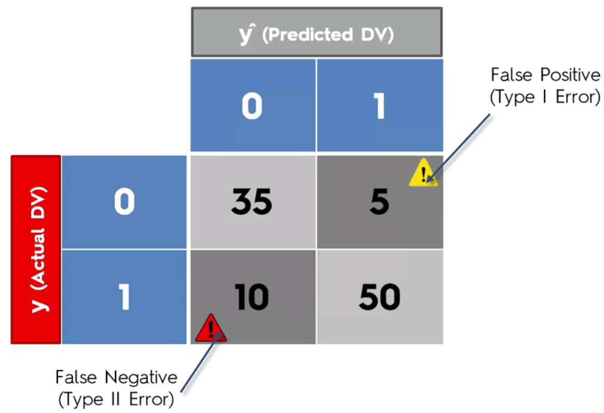
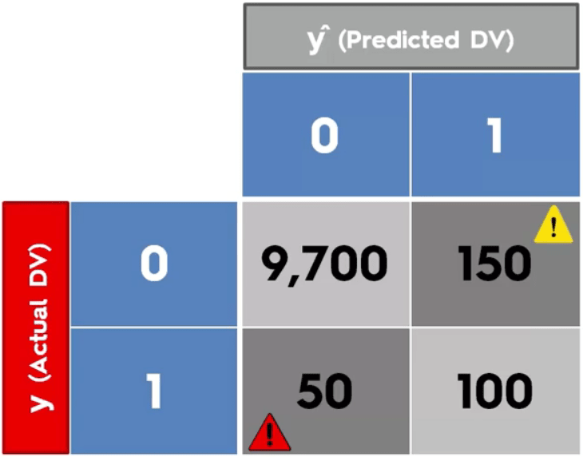
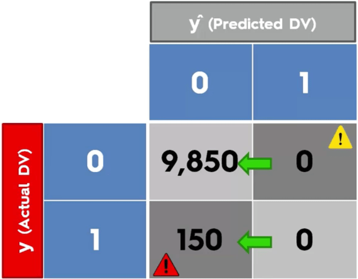
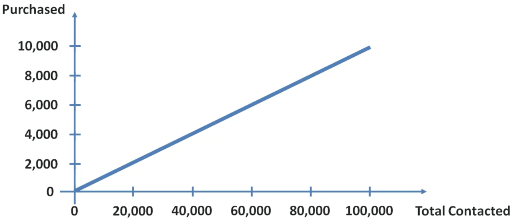
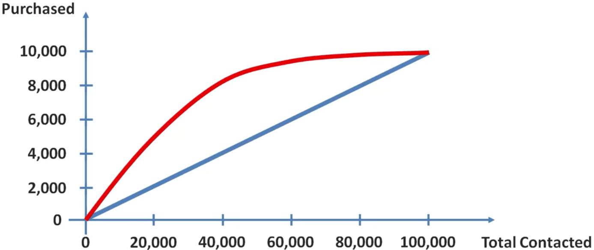

# Evaluating Classification Models Performance

## False Positives & Negatives

* False positive (Type 1 Error): We predicted that the point will be in the positive class but it was actually in the negative one. So, our predict was false.
* False negative (Type 2 Error): We predicted that the point will be in the negative class but it was actually in the positive one. So, our predict was false.

## Confusion Matrix

It is a matrix with 4 values:

* The number of data points we predicted in the positive class and it was
* The number of data points we predicted in the negative class and it was
* The number of data points we predicted in the positive class and it was not
* The number of data points we predicted in the negative class and it was not

We can find 2 additional values from this matrix:

* Accuracy rate = Correct / Total
* Error rate = Wrong / Total

## Accuracy Paradox

Imagine this confusion matrix:

As can be seen, the accuracy here is 98%.

If we stop the model and always predict 0, the confusion matrix will become this:

This time, the accuracy is 98.5%.

We stoped the model but the accuracy went up. This is called the accuracy paradox.

## CAP Curve

Imagine a company sending offers to people randomly and the response rate of people is 10%. The curve of this relation is this:

Now imagine we target people who are more likely to respond to the offer. So, each group of people will have its own response rate. The curve of this relation becomes this:

This curve is called the CAP (Cumulative Accuracy Profile) curve.