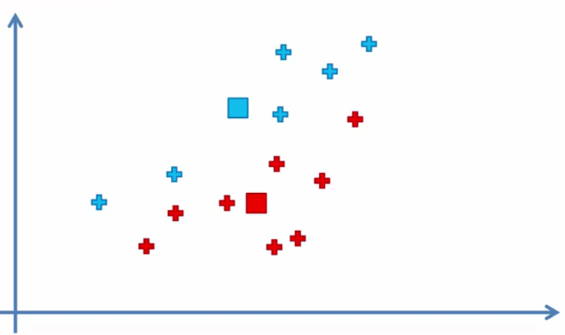

# K-Means Clustering

## Intuition

Here we got a dataset:


Can we identify different groups between the points?

K-Means take out the groups which are called **clusters**:


### Steps

What are the steps of the K-Means algorithm:

1. Choose the number K of clusters
2. Select at random K points, the centroids (not necessarily from our dataset)
3. Assign each data point to the closest centroid => That forms K clusters
4. Compute and place the new centroid of each cluster
5. Redo step 3. If any point's centroid change go to 4, else go to FIN

Let's see a visual example to understand better:

#### Step 1: Choose the number K of clusters: K = 2

#### Step 2: Select at random K points, the centroids (not necessarily from our dataset)


#### Step 3: Assign each data point to the closest centroid => That forms K clusters


#### Step 4: Compute and place the new centroid of each cluster



#### Step 5: Redo step 3. If any point's centroid change go to 4, else go to FIN


And finally our model is ready:


### Random Initialization Trap

The first random centroids that we choose can change the result of the K-Means algorithm.

The solution to do that **K-Means++** which we are not going to talk about. The good thing is that Python actually takes care of this in the back.

### Choosing the right number of clusters

We use the **WCSS** method to find the optimal number of clusters. WCSS is calculated in this way:


It is a decreasing value. More the clusters, less the WCSS.


As can be seen it makes huge drops at first but then it makes less drops. To find the optimal number of clusters we use the elbow method. That is to find the point where WCSS shapes an elbow. the drop changes from huge to little.

## Practical

### Importing the dataset

```python
dataset = pd.read_csv('Mall_Customers.csv')
X = dataset.iloc[:, [3, 4]].values
```

The reason why we choose only the last two columns is to be able to show the result in 2D chart.

In clustering we do not have the dependent variable.

### Using the elbow method to find the optimal number of clusters

```python
from sklearn.cluster import KMeans
wcss = []
for i in range(10):
    kmeans = KMeans(n_clusters=i + 1, random_state=42)
    kmeans.fit(X)
    wcss.append(kmeans.inertia_)
plt.plot(range(1, 11), wcss)
plt.title("The Elbow Method")
plt.xlabel("Number of Clusters")
plt.ylabel("WCSS")
plt.show()
```


### Training the K-Means model on the dataset

```python
kmeans = KMeans(n_clusters=5, random_state=42)
y_kmeans = kmeans.fit_predict(X)
```

### Visualising the clusters

```python
plt.scatter(X[y_kmeans == 0, 0], X[y_kmeans == 0, 1], s=100, c="red", label="Cluster 1")
plt.scatter(X[y_kmeans == 1, 0], X[y_kmeans == 1, 1], s=100, c="blue", label="Cluster 2")
plt.scatter(X[y_kmeans == 2, 0], X[y_kmeans == 2, 1], s=100, c="green", label="Cluster 3")
plt.scatter(X[y_kmeans == 3, 0], X[y_kmeans == 3, 1], s=100, c="cyan", label="Cluster 4")
plt.scatter(X[y_kmeans == 4, 0], X[y_kmeans == 4, 1], s=100, c="magenta", label="Cluster 5")
plt.scatter(kmeans.cluster_centers_[:, 0], kmeans.cluster_centers_[:, 1], s=300, c="yellow", label="Centroids")
plt.title("Clusters of Customers")
plt.xlabel("Annual Income (k$)")
plt.ylabel("Spending Score (1-100)")
plt.legend()
plt.show()
```

