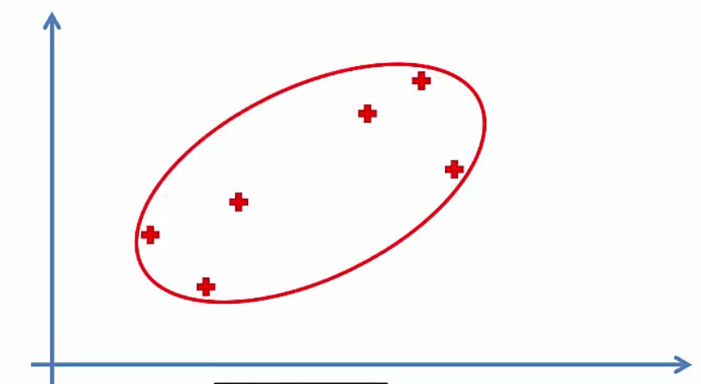
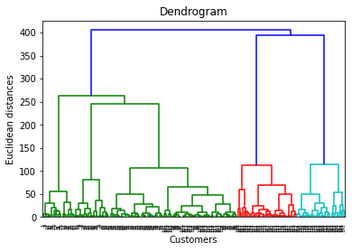

# Hierarchical Clustering

## Intuition

Similiar to K-Means but different approach.

### Understanding HC

There are 2 types of HC:

* Agglomerative
* Divisive

#### Agglomerative HC

It works in multiple steps:

1. Make each data point a single-point cluster => That forms N clusters
2. Take the two closest data points and make them one cluster => That forms N-1 clusters
3. Take the two closest clusters and make them one cluster => That forms N-2 clusters
4. Repeat step 3 until there is only one cluster

There multiple options to calculate the distance between two clusters:

* Closest points
* Furthest points
* Average points
* Distance Between Centroids

Let's look at an example:

##### Step 1: Make each data point a single-point cluster => That forms 6 clusters


##### Step 2: Take the two closest data points and make them one cluster => That forms 5 clusters


##### Step 3: Take the two closest clusters and make them one cluster => That forms 4 clusters


##### Step 2: Repeat step 3 until there is only one cluster




The Divisive HC is the opposite of this way.

### Dendrograms

They are a way to show how similar two clusters are.

Let's understand them through and example (The left charts shows dendrograms):


### How to use dendrograms

We set a distance threshold to indicate we do not want a dissimilarity to be more than a value. This way the example above will become 2 clusters if we choose the threshold 1.75. We can also count the numbers the threshold line crosses the dendrograms to find the number of clusters.


To find the optimal number of clusters we should do this:

1. Imagine all the horizontal lines extend to the width of the chart
2. Find the biggest vertical lines that no horizontal line crosses it.
3. Choose the threshold in that distance.


## Practical

### Using the dendrogram to find the optimal number of clusters

```python
import scipy.cluster.hierarchy as sch
dendrogram = sch.dendrogram(sch.linkage(X, method="ward"))
plt.title("Dendrogram")
plt.xlabel("Customers")
plt.ylabel("Euclidean distances")
plt.show()
```



### Training the Hierarchical Clustering model on the dataset

```python
from sklearn.cluster import AgglomerativeClustering
hc = AgglomerativeClustering(n_clusters=5)
y_hc = hc.fit_predict(X)
```

### Visualising the clusters

```python
plt.scatter(X[y_hc == 0, 0], X[y_hc == 0, 1], s=100, c="red", label="Cluster 1")
plt.scatter(X[y_hc == 1, 0], X[y_hc == 1, 1], s=100, c="blue", label="Cluster 2")
plt.scatter(X[y_hc == 2, 0], X[y_hc == 2, 1], s=100, c="green", label="Cluster 3")
plt.scatter(X[y_hc == 3, 0], X[y_hc == 3, 1], s=100, c="cyan", label="Cluster 4")
plt.scatter(X[y_hc == 4, 0], X[y_hc == 4, 1], s=100, c="magenta", label="Cluster 5")
plt.title("Clusters of Customers")
plt.xlabel("Annual Income (k$)")
plt.ylabel("Spending Score (1-100)")
plt.legend()
plt.show()
```

