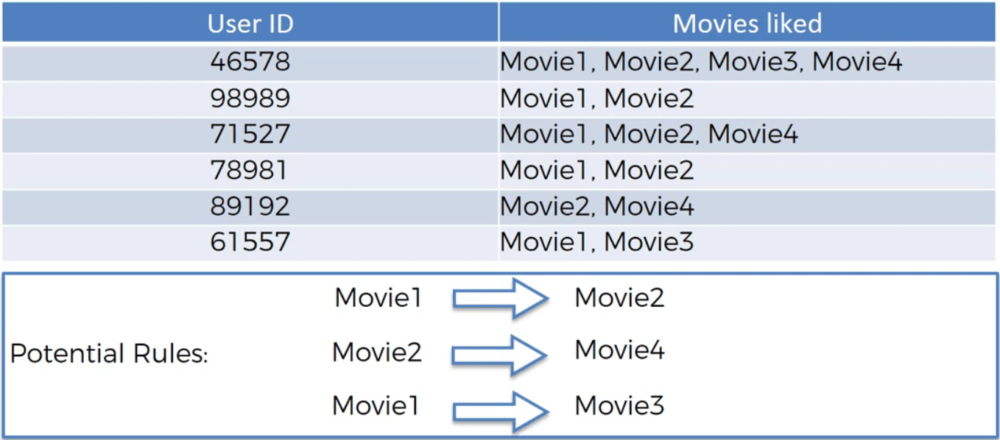
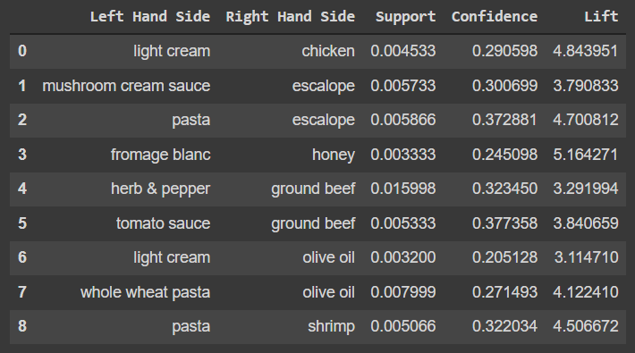
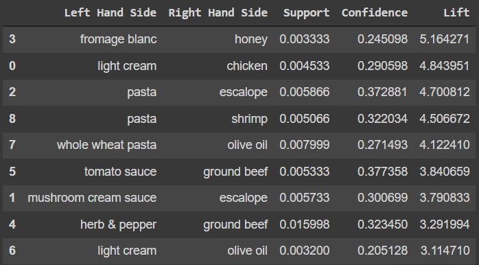

# Apriori

## Intuition

Apriori is about people who bought something, also bought something else. This can be about watched or listened, ... . Our goal is to find that something else.



Apriori algorithms has three parts:

1. Support
2. Confidence
3. Lift

### Support

Imagine a movie recommendation system. The support for move M (support(M)) is calculated by dividing **the number of watchlists containing M** by **the number of user watchlists**.

### Confidence

With the same example, the confidence of movies M1 and M2 (confidence(M1 -> M2)) is calculated by dividing **the number of watchlists containing M1 and M2** by **the number of watchlists containing M1**.

### Lift

Again with the same example, the lift of movies M1 and M2 (lift(M1 -> M2)) is calculated by dividing **the confidence of M1 and M2 (confidence(M1 -> M2))** by **the support of M2 (support(M2))**.

### Steps of Apriori Algorithm

1. Set a minimum support and confidence
2. Take all the subsets in transactions having higher support than minimum support
3. Take all the rules of these subsets having higher confidence than minimum confidence
4. Sort the rules by decreasing lift

## Practical

### Importing the libraries

Scikit-learn does not have a module for apriori. So we will use apyori:

```python
!pip install apyori
```

### Data Preprocessing

Apyori gets the data set as a list of lists. Here we transform the dataset from pandas dataframe to a list of lists:

```python
dataset = pd.read_csv("Market_Basket_Optimisation.csv", header=None)
transactions = []
for i in range(len(dataset)):
    transactions.append([str(dataset.values[i, j]) for j in range(len(dataset.values[0]))])
```

### Training the Apriori model on the dataset

Apyori's apriori module gets a number of inputs:

* transactions: our dataset (list of lists)
* min_support: the minimum value of support
* min_confidence: the minimum value of confidence
* min_lift: the minimum value of lift
* min_length: the minimum number of items in a rule
* max_length: the maximum number of items in a rule

```python
from apyori import apriori
rules = apriori(transactions=transactions, min_support=0.003, min_confidence=0.2,
                min_lift=3, min_length=2, max_length=2)
```

### Visualising the results

#### Displaying the first results coming directly from the output of the apriori function

```python
results = list(rules)
results
```

```python
[RelationRecord(items=frozenset({'chicken', 'light cream'}), support=0.004532728969470737, ordered_statistics=[OrderedStatistic(items_base=frozenset({'light cream'}), items_add=frozenset({'chicken'}), confidence=0.29059829059829057, lift=4.84395061728395)]),
 RelationRecord(items=frozenset({'escalope', 'mushroom cream sauce'}), support=0.005732568990801226, ordered_statistics=[OrderedStatistic(items_base=frozenset({'mushroom cream sauce'}), items_add=frozenset({'escalope'}), confidence=0.3006993006993007, lift=3.790832696715049)]),
 RelationRecord(items=frozenset({'escalope', 'pasta'}), support=0.005865884548726837, ordered_statistics=[OrderedStatistic(items_base=frozenset({'pasta'}), items_add=frozenset({'escalope'}), confidence=0.3728813559322034, lift=4.700811850163794)]),
 RelationRecord(items=frozenset({'fromage blanc', 'honey'}), support=0.003332888948140248, ordered_statistics=[OrderedStatistic(items_base=frozenset({'fromage blanc'}), items_add=frozenset({'honey'}), confidence=0.2450980392156863, lift=5.164270764485569)]),
 RelationRecord(items=frozenset({'ground beef', 'herb & pepper'}), support=0.015997866951073192, ordered_statistics=[OrderedStatistic(items_base=frozenset({'herb & pepper'}), items_add=frozenset({'ground beef'}), confidence=0.3234501347708895, lift=3.2919938411349285)]),
 RelationRecord(items=frozenset({'ground beef', 'tomato sauce'}), support=0.005332622317024397, ordered_statistics=[OrderedStatistic(items_base=frozenset({'tomato sauce'}), items_add=frozenset({'ground beef'}), confidence=0.3773584905660377, lift=3.840659481324083)]),
 RelationRecord(items=frozenset({'olive oil', 'light cream'}), support=0.003199573390214638, ordered_statistics=[OrderedStatistic(items_base=frozenset({'light cream'}), items_add=frozenset({'olive oil'}), confidence=0.20512820512820515, lift=3.1147098515519573)]),
 RelationRecord(items=frozenset({'olive oil', 'whole wheat pasta'}), support=0.007998933475536596, ordered_statistics=[OrderedStatistic(items_base=frozenset({'whole wheat pasta'}), items_add=frozenset({'olive oil'}), confidence=0.2714932126696833, lift=4.122410097642296)]),
 RelationRecord(items=frozenset({'pasta', 'shrimp'}), support=0.005065991201173177, ordered_statistics=[OrderedStatistic(items_base=frozenset({'pasta'}), items_add=frozenset({'shrimp'}), confidence=0.3220338983050847, lift=4.506672147735896)])]
```

Note that in the results above, the items is read like this: *people who have bought light cream, are more likely to buy chiken*. It's kind of the inverse of how it is written.

#### Putting the results well organised into a Pandas DataFrame

```python
def inspect(results):
    lhs         = [tuple(result[2][0][0])[0] for result in results]
    rhs         = [tuple(result[2][0][1])[0] for result in results]
    supports    = [result[1] for result in results]
    confidences = [result[2][0][2] for result in results]
    lifts       = [result[2][0][3] for result in results]
    return list(zip(lhs, rhs, supports, confidences, lifts))
resultsinDataFrame = pd.DataFrame(inspect(results), columns = ['Left Hand Side', 'Right Hand Side', 'Support', 'Confidence', 'Lift'])
```

#### Displaying the results non sorted

```python
resultsinDataFrame
```



#### Displaying the results sorted by descending lifts

```python
resultsinDataFrame.nlargest(n=10, columns="Lift")
```

