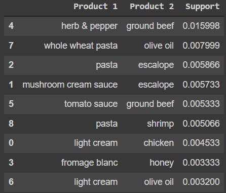

# Eclat

## Intuition

Eclat is kind of a simpler version of apriori. In apriori model we came up with rules, but in eclat we come up with sets.

In eclat we only have support. Note that in support we do not input only 1 movie. We input a set of movies.

The steps here are:

1. Set a minimum support
2. Take all the subsets in transactions having higher support than minimum support
3. Sort these subsets by decreasing support

## Practical

### Training the Eclat model on the dataset

```python
from apyori import apriori
rules = apriori(transactions = transactions, min_support = 0.003, min_confidence = 0.2, min_lift = 3, min_length = 2, max_length = 2)
```

### Visualising the results

#### Displaying the first results coming directly from the output of the apriori function

```python
results = list(rules)
results
```

```python
[RelationRecord(items=frozenset({'light cream', 'chicken'}), support=0.004532728969470737, ordered_statistics=[OrderedStatistic(items_base=frozenset({'light cream'}), items_add=frozenset({'chicken'}), confidence=0.29059829059829057, lift=4.84395061728395)]),
 RelationRecord(items=frozenset({'escalope', 'mushroom cream sauce'}), support=0.005732568990801226, ordered_statistics=[OrderedStatistic(items_base=frozenset({'mushroom cream sauce'}), items_add=frozenset({'escalope'}), confidence=0.3006993006993007, lift=3.790832696715049)]),
 RelationRecord(items=frozenset({'escalope', 'pasta'}), support=0.005865884548726837, ordered_statistics=[OrderedStatistic(items_base=frozenset({'pasta'}), items_add=frozenset({'escalope'}), confidence=0.3728813559322034, lift=4.700811850163794)]),
 RelationRecord(items=frozenset({'fromage blanc', 'honey'}), support=0.003332888948140248, ordered_statistics=[OrderedStatistic(items_base=frozenset({'fromage blanc'}), items_add=frozenset({'honey'}), confidence=0.2450980392156863, lift=5.164270764485569)]),
 RelationRecord(items=frozenset({'herb & pepper', 'ground beef'}), support=0.015997866951073192, ordered_statistics=[OrderedStatistic(items_base=frozenset({'herb & pepper'}), items_add=frozenset({'ground beef'}), confidence=0.3234501347708895, lift=3.2919938411349285)]),
 RelationRecord(items=frozenset({'ground beef', 'tomato sauce'}), support=0.005332622317024397, ordered_statistics=[OrderedStatistic(items_base=frozenset({'tomato sauce'}), items_add=frozenset({'ground beef'}), confidence=0.3773584905660377, lift=3.840659481324083)]),
 RelationRecord(items=frozenset({'light cream', 'olive oil'}), support=0.003199573390214638, ordered_statistics=[OrderedStatistic(items_base=frozenset({'light cream'}), items_add=frozenset({'olive oil'}), confidence=0.20512820512820515, lift=3.1147098515519573)]),
 RelationRecord(items=frozenset({'olive oil', 'whole wheat pasta'}), support=0.007998933475536596, ordered_statistics=[OrderedStatistic(items_base=frozenset({'whole wheat pasta'}), items_add=frozenset({'olive oil'}), confidence=0.2714932126696833, lift=4.122410097642296)]),
 RelationRecord(items=frozenset({'pasta', 'shrimp'}), support=0.005065991201173177, ordered_statistics=[OrderedStatistic(items_base=frozenset({'pasta'}), items_add=frozenset({'shrimp'}), confidence=0.3220338983050847, lift=4.506672147735896)])]
```

#### Putting the results well organised into a Pandas DataFrame

```python
def inspect(results):
    lhs         = [tuple(result[2][0][0])[0] for result in results]
    rhs         = [tuple(result[2][0][1])[0] for result in results]
    supports    = [result[1] for result in results]
    return list(zip(lhs, rhs, supports))
resultsinDataFrame = pd.DataFrame(inspect(results), columns = ['Product 1', 'Product 2', 'Support'])
```

#### Displaying the results sorted by descending supports

```python
resultsinDataFrame.nlargest(n = 10, columns = 'Support')
```

