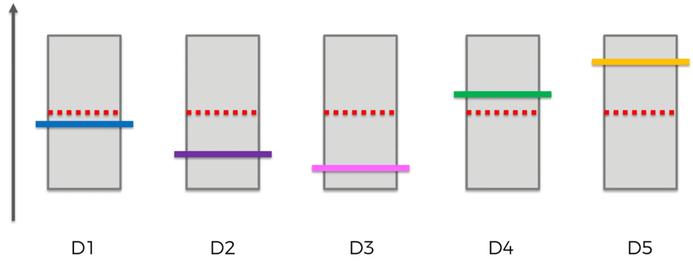
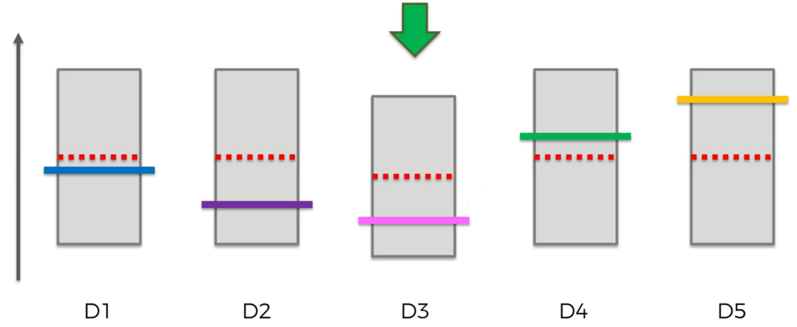
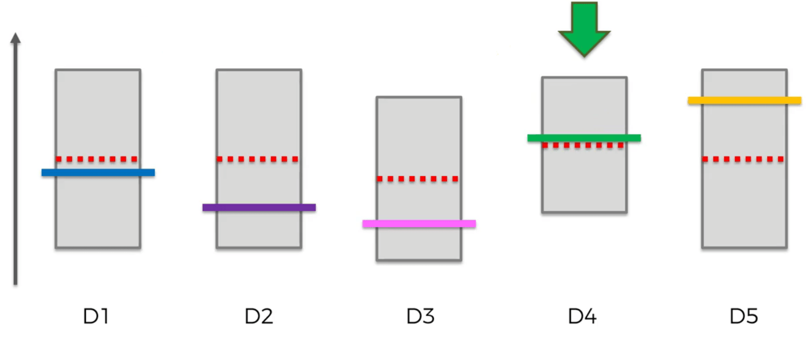
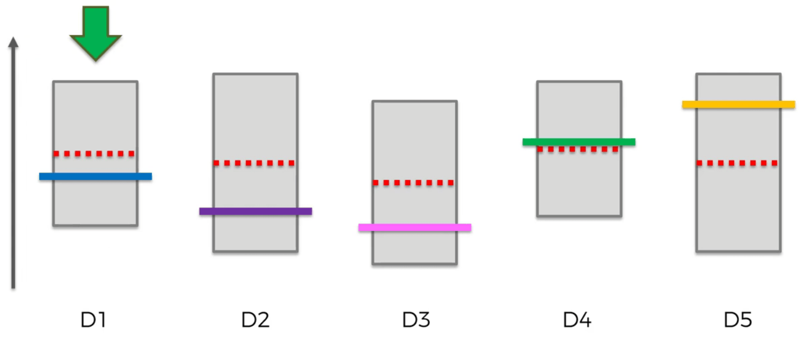
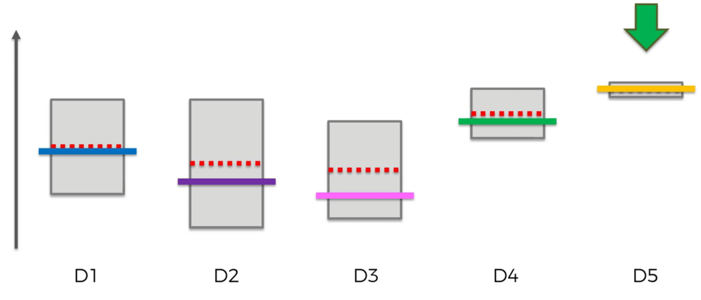
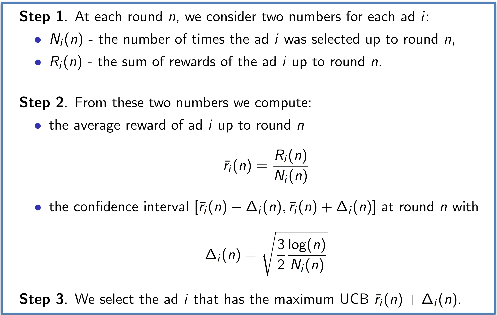
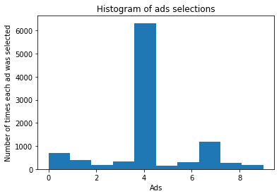

# Upper Confidence Bound (UCB)

## Intuition

### The Multi-Armed Bandit Problem

The one-armed bandits are these devices:


The multi-armed is when it has more than one arm. These devices have a distribution behind them for determining wins or losses. However we do not know these distribution. That is why we have to use trial and erro wich is the core of reinforcement learning.

To put it differently, here is this problem with advertising:

* We have d arms. For example, arms are ads that we display to users each time they connect to a web page.
* Each time a user connects to a web page, that makes a round.
* At each round n, we choose one ad to display to the user.
* At each round n, ad i gives reward r_i(n) which is 0 or 1. r_i(n) = 1 if the user clicked on the ad i, 0 if the user did not.
* Our goal is to maximize the total reward we get over many rounds.

### The Algorithm

At first, we do not know the distribution. So, we choose an equal value for all of the machines. There is also a bound for the real value to be. Then, with trial and error we find the best distribution. Here, are some pictures of the procedure to better understand. Note that, when in a trial we win, the value gets higher and vice versa. Also, after a trial the bound of that machine becomes smaller since the observations have gotten bigger. Moreover, in each trial we choose the machine that has the higest upper bound.









And finaly, we will have a chart like this:



This is the algorithm with more details:



## Practical

### Implementing UCB

```python
import math
ads_selected = []
numbers_of_selections = [0] * len(dataset.columns)
sums_of_rewards = [0] * len(dataset.columns)
total_reward = 0
for i in range(len(dataset.values)):
    chosen_ad = 0
    max_upper_bound = 0
    for j in range(len(dataset.values[i])):
        if numbers_of_selections[j] != 0:
            average_reward = sums_of_rewards[j] / numbers_of_selections[j]
            delta_i = math.sqrt((3 * math.log(i + 1)) / (2 * numbers_of_selections[j]))
            upper_bound = average_reward + delta_i
        else:
            upper_bound = 1e400
        if upper_bound > max_upper_bound:
            max_upper_bound = upper_bound
            chosen_ad = j
    ads_selected.append(chosen_ad)
    numbers_of_selections[chosen_ad] += 1
    sums_of_rewards[chosen_ad] += dataset.values[i][chosen_ad]
    total_reward += dataset.values[i][chosen_ad]
```

### Visualising the results

```python
plt.hist(ads_selected)
plt.title("Histogram of ads selections")
plt.xlabel("Ads")
plt.ylabel("Number of times each ad was selected")
plt.show()
```

