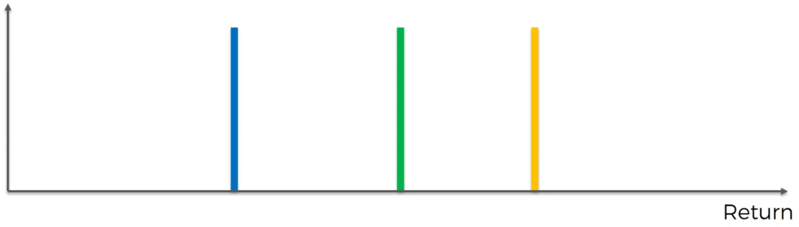
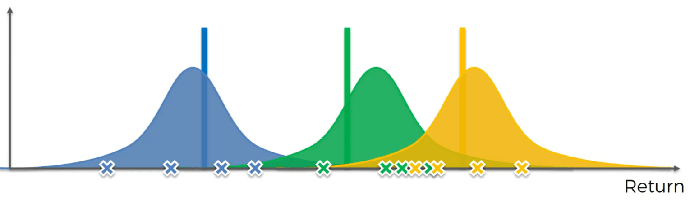
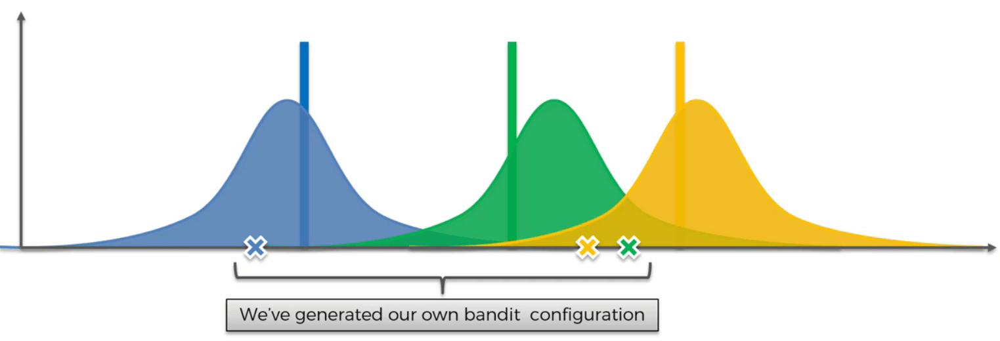
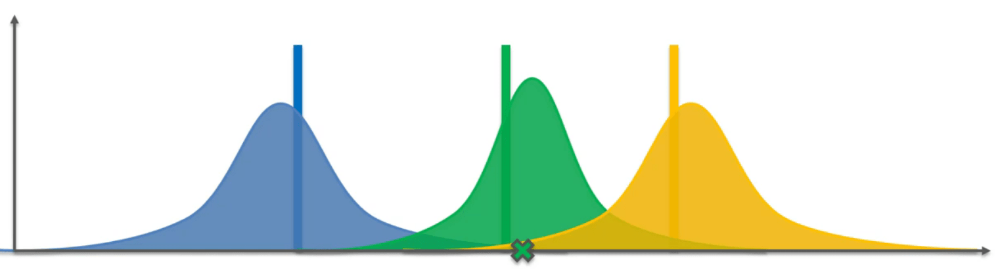
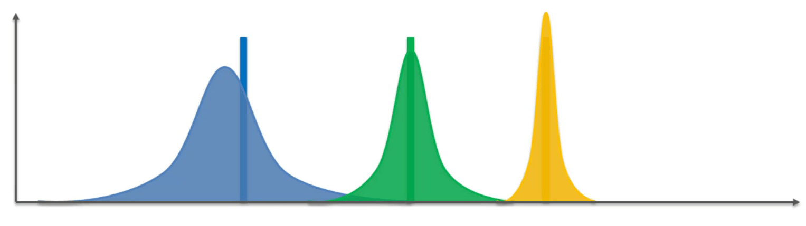
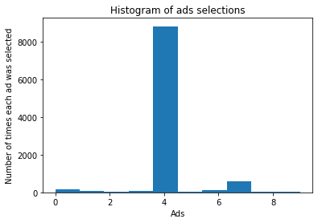

# Thompson Sampling

## Intuition

In this algorithm we are going to generate distribution for the bandits. Imagine we have 3 bandits like bellow:



We are going to activate each bandit multiple times so we have some values for each of them. Then, with these values we generate a distribution for the bandits:



Note that these distribution are not made to predict the real distribution. They are made to give us the expected values of each bandit.

Then, with these distribution we generate one value for each bandit:



These values create a virtual world with three bandits and obviously we have to choose the best one which is the one to the right. The green one.

Now in the real world we will generate a value with the green distribution and change the distribution accordingly:



We will continue these steps until we get this:



### UCB vs Thompson

* UCB is **deterministic**, but Thompson is **probabilistic**
* UCB requires updates at every round, but Thompson can accommodate delayed feedback
* Thompson has better empirical evidence

## Practical

### Implementing Thompson Sampling

```python
import random
ads_selected = []
numbers_of_rewards_1 = [0] * len(dataset.columns)
numbers_of_rewards_0 = [0] * len(dataset.columns)
total_reward = 0
for i in range(len(dataset.values)):
    chosen_ad = 0
    max_random = 0
    for j in range(len(dataset.values[i])):
        random_beta = random.betavariate(numbers_of_rewards_1[j] + 1, numbers_of_rewards_0[j] + 1)
        if random_beta > max_random:
            max_random = random_beta
            chosen_ad = j
    ads_selected.append(chosen_ad)
    if dataset.values[i][chosen_ad] == 1:
        numbers_of_rewards_1[chosen_ad] += 1
    else:
        numbers_of_rewards_0[chosen_ad] += 1
    total_reward += dataset.values[i][chosen_ad]
```

### Visualising the results - Histogram

```python
plt.hist(ads_selected)
plt.title('Histogram of ads selections')
plt.xlabel('Ads')
plt.ylabel('Number of times each ad was selected')
plt.show()
```

