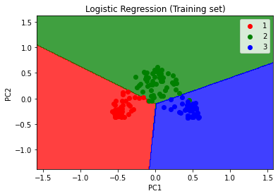
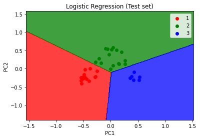

# Kernel PCA

## Practical

### Applying Kernel PCA

```python
from sklearn.decomposition import KernelPCA
kpca = KernelPCA(n_components=2, kernel="rbf")
X_train = kpca.fit_transform(X_train)
X_test = kpca.transform(X_test)
```

### Visualising the Training set results



### Visualising the Test set results

